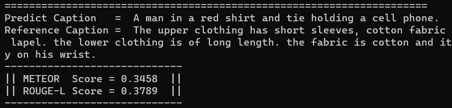
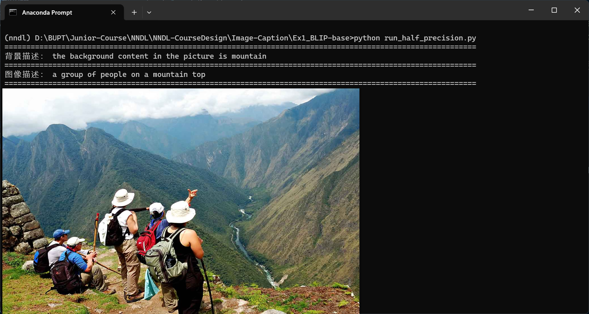

## 题目：基于编解码框架方法的图像描述生成

> 2023 秋季北京邮电大学深度学习与神经网络课程设计

## 零、快速开始

1. 克隆该项目：

```
git clone git@github.com:Conqueror712/Image-Caption.git
```

2. 进入根目录：

```
cd Image-Caption
```

## 一、运行 Transformer 模型的方法

```
cd Model2_Transformer
python predict.py --path ../data/images_demo/MEN-Denim-id_00000089-03_7_additional.jpg   # demo 1
python predict.py --path ../data/images_demo/WOMEN-Tees_Tanks-id_00007976-01_4_full.jpg  # demo 2
```

> 查看结果：

demo 1:

demo 2:


## 二、运行 BLIP 多模态模型的方法

```
cd Ex1_BLIP-base
pip install -r requirements.txt
python run_half_precision.py
```

> 查看结果：

demo 1:


demo 2:



demo 3:


## 三、组员分工及检查点

> 分工表：

|                            巩羽飞                            |                       黄成梓                       |
| :----------------------------------------------------------: | :------------------------------------------------: |
| 模型：网格 / 区域表示、Transformer 编码器 + Transformer 解码器 |      模型：网格 / 区域表示、自注意力 + 注意力      |
|                    指标：METEOR + ROUGE-L                    |                   指标：CIDEr-D                    |
|   其他：微调多模态预训练模型或多模态大语言模型，并测试性能   | 其他：实现基于强化学习的损失函数，直接优化评测指标 |

> 检查点：

|        |  Point 1  |          Point 2           |      Point 3      |          Point 4          |
| ------ | :-------: | :------------------------: | :---------------: | :-----------------------: |
| 巩羽飞 | 开题报告✅ | 跑通负责的模型 + 评测指标✅ |     中期报告✅     | 附加任务微调多模态大模型✅ |
| 黄成梓 | 开题报告✅ | 跑通负责的模型 + 评测指标✅ | 附加任务优化指标✅ |         结题报告          |

## 四、时间安排

|   11.25   |        11.30         |            12.12             |                12.28                |
| :-------: | :------------------: | :--------------------------: | :---------------------------------: |
| 开题报告✅ | 模型跑通 + 评测指标✅ | 中期报告 + 附加任务优化指标✅ | 结题报告 + 附加任务微调多模态大模型 |
