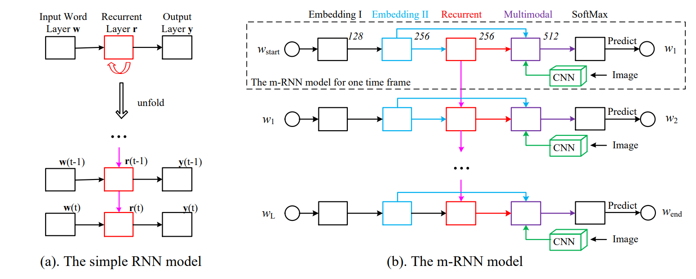
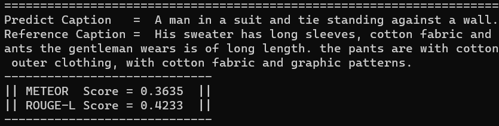

## 结题报告——Image Caption

> 2023 秋季北京邮电大学深度学习与神经网络课程设计

## 一、任务说明

我们开发了一个基于编解码框架的图像描述生成系统。这个系统能够自动为输入的图片生成流畅且关联的自然语言描述。我们采用了 Show and Tell, Attention and Self-Attention, Transformer Encoder and Decoder 这三个模型结构来实现这个任务，接下来我们将在第四部分逐个介绍。

至于什么是图像描述技术，其实就是以图像为输入，通过数学模型和计算使计算机输出对应图像的自然语言描述文字，使计算机拥有看图说话的能力，是图像处理领域中继图像识别、图像分割和目标跟踪之后的又一新型任务。在日常生活中，人们可以将图像中的场景、色彩、逻辑关系等低层视觉特征信息自动建立关系，从而感知图像的高层语义信息，但是计算机作为工具只能提取到数字图像的低层数据特征，而无法像人类大脑一样生成高层语义信息，这就是计算机视觉中的语义鸿沟问题。图像描述技术的本质就是将计算机提取的图像视觉特征转化为高层语义信息，即解决语义鸿沟问题，使计算机生成与人类大脑理解相近的对图像的文字描述，从而可以对图像进行分类、检索、分析等处理任务。

我们通过完成这个课程设计作业，深入理解了编解码框架、自注意力机制、Transformer 模型等先进的深度学习技术，并能够将这些技术应用到实际问题中，不仅让我们更好的掌握了理论课上学到的知识，更锻炼了我们的动手实践能力。

## 二、实验数据

### 2.1 原始数据

我们使用了 DeepFashion-MultiModal 数据集中 image 和 textual descriptions 的数据，其中 80% 的数据作为模型的训练集，20% 作为模型的测试集。数据集的 Github Repo 如下：

>  https://github.com/yumingj/DeepFashion-MultiModal

由于数据对应的 json 文件已经提前划分好，但是 images 文件夹仍然是混合在一起的，所以我们编写了一个 Python 脚本用于将 images 划分为 train_images 和 test_images，如下所示：

```Python
import os
import json
import shutil

# 读取json文件并转换为字典
with open('../../data/test_captions.json', 'r') as f:
    test_captions = json.load(f)

with open('../../data/train_captions.json', 'r') as f:
    train_captions = json.load(f)

# 指定源目录和目标目录
source_directory = '../../data/images'
train_directory = '../../data/train_images'
test_directory = '../../data/test_images'

# 确保目标目录存在
os.makedirs(train_directory, exist_ok=True)
os.makedirs(test_directory, exist_ok=True)

# 将训练集图片复制到目标目录
for image in train_captions:
    shutil.copy(os.path.join(source_directory, image), train_directory)

# 将测试集图片复制到目标目录
for image in test_captions:
    shutil.copy(os.path.join(source_directory, image), test_directory)
```

另外，我们还发现图像的关键点信息并没有在 json 文件中显示，而是在图像的文件名中，所以我们通过正则表达式，提取了每张图像的关键点信息，并更新了 json 文件，如下所示：

```Python
import os
import re
import json

# 定义一个函数来解析文件名
def parse_filename(filename):
    # 使用正则表达式匹配文件名
    pattern = r'^(?P<gender>\w+)-(?P<clothing>[\w_]+)-id_(?P<id>\d+)-(?P<group>\d+)_(\d+_(?P<body>\w+))\.jpg$'
    match = re.match(pattern, filename)
    if match:
        return match.groupdict()
    else:
        return None

# 定义一个函数来处理目录中的所有文件
def process_directory(directory):
    # 创建一个字典来存储结果
    results = {}
    # 遍历目录中的所有文件
    for filename in os.listdir(directory):
        # 解析文件名
        info = parse_filename(filename)
        if info:
            # 将解析的信息与文件名关联起来
            results[filename] = info
    return results

# 使用函数处理目录
directory = '../../data/images'
results = process_directory(directory)

# 将结果保存到json文件中
with open('../../data/label.json', 'w') as f:
    json.dump(results, f, ensure_ascii=False, indent=4)
```

### 2.2 背景描述增量数据

我们使用老师在群里提供的数据（一开始我们自己找了一个，但是发现不合适）。

> https://pan.baidu.com/s/1qN3EEUNXh4nUcNZMCoT9Fg?pwd=rnfw (rnfw)

同样地，我们将其重命名并划分为 train_images 和 test_images，比例为 9:1。


图片重命名的代码片段如下：

```Python
def rename_images(folder_path):
    # 检查文件夹是否存在
    if not os.path.exists(folder_path):
        print(f"文件夹 '{folder_path}' 不存在。")
        return

    # 获取文件夹下所有文件
    files = os.listdir(folder_path)

    # 迭代处理每个文件
    for index, file_name in enumerate(files):
        old_path = os.path.join(folder_path, file_name)
        new_name = f"train_{index + 1}.jpg"
        new_path = os.path.join(folder_path, new_name)
        os.rename(old_path, new_path)
        print(f"重命名文件: {file_name} -> {new_name}")
```

## 三、实验环境

- Ubuntu 20.04 / Ubuntu 22.04 / Windows 11
- NVIDIA GPU and NVIDIA CUDA Driver
- CUDA 12.2 / CUDA 11.8
- Python 3.10

具体的第三方库依赖请见 `requirements.txt`

## 四、模型选择

首先，作为共性特点，我们先来介绍一下基于编解码器的方法：

随着深度学习技术的不断发展，神经网络在计算机视觉和自然语言处理领域得到了广泛应用。受机器翻译领域中编解码器模型的启发，图像描述可以通过端到端的学习方法直接实现图像和描述句子之间的映射，将图像描述过程转化成为图像到描述的"翻译"过程。基于深度学习的图像描述生成方法大多采用以 CNN-RNN 为基本模型的编解码器框架，CNN 决定了整个模型的图像识别能力，其最后的隐藏层的输出被用作解码器的输入，RNN 是用来读取编码后的图像并生成文本描述的网络模型，下图是一个简单递归神经网络 RNN 和多模态递归神经网络 m-RNN 架构的示意图：



之所以是 CNN 决定了整个模型的图像识别能力，RNN 被用来读取编码后的图像并生成文本描述的网络模型，是因为计算机视觉问题有很强的局部特征，即一个像素和它周围的旁边几个像素有很强的关联性，但是离他非常远的像素之间的关联性就比较弱，所以只需要像 CNN 一样在局部做连接，而不需要像全连接网络一样每一层之间都是全连接的，从而大大降低了权重的数量。而 RNN 通过使用带自反馈的神经元，也就是隐藏状态，能够处理任意长度的序列数据，可以有效保存序列数据的历史信息。


### 4.1 Show and Tell（就是老师给的那个）

> 待补充

### 4.2 Attention and Self Attention

近年来，注意力机制被广泛应用于计算机视觉领域，其本质是为了解决编解码器在处理固定长度向量时的局限性。注意力机制并不是将输入序列编码成一个固定向量，而是通过增加一个上下文向量来对每个时间步的输入进行解码，以增强图像区域和单词的相关性，从而获取更多的图像语义细节，下图是一个学习单词 / 图像对齐过程的示意图：


我们利用网格 / 区域表示 + 自注意力 + 注意力的模型结构来完成副使图像描述任务。

#### 4.2.1 参数配置方面

`configurations.py` 文件中定义的 `Config` 类作为项目的配置中心，其作用是集中管理项目中使用的所有配置参数。这些参数通常包括文件路径、模型参数、数据处理选项、训练设置和图像处理参数等。通过这种方式，可以在不修改代码的情况下调整项目的行为。以下是 `Config` 类中定义的配置参数及其作用：

1. **数据路径**：
   - `data_path`：主数据目录路径。
   - `images_path`：存储图像的路径。
   - `train_captions_path`：训练集的文本描述文件路径。
   - `test_captions_path`：测试集的文本描述文件路径。
   - `output_folder`：用于存储词汇表和处理后数据的输出文件夹路径。

2. **模型参数**：
   - `embed_size`：嵌入向量的维度。
   - `vocab_size`：词汇表的大小。
   - `num_layers`：定义循环神经网络中的层数。
   - `num_heads`：自注意力机制中头的数量。
   - `dropout`：在模型中使用的 Dropout 比率。
   - `hidden_size`：隐藏层的维度。
   - `image_code_dim`：图像编码的维度。
   - `word_dim`：词嵌入的维度。
   - `attention_dim`：注意力机制的隐藏层维度。

3. **数据处理参数**：
   - `min_word_count`：词汇表中词的最小出现次数，用于筛选词汇。
   - `max_len`：假设的描述的最大长度。

4. **训练参数**：
   - `batch_size`：每个批次的大小。
   - `learning_rate`：学习率。
   - `num_epochs`：训练的总轮次数。
   - `workers`：加载数据时使用的工作线程数。
   - `encoder_learning_rate`：编码器的学习率。
   - `decoder_learning_rate`：解码器的学习率。
   - `lr_update`：学习率更新频率。

5. **图像预处理参数**：
   - `image_size`：图像缩放后的大小。
   - `crop_size`：从缩放后的图像中裁剪出的大小。

6. **其他配置**：
   - `device`：设置运行计算的设备，如果 CUDA 可用则使用 GPU，否则使用 CPU。

#### 4.2.2 数据预处理方面

为图像描述任务准备和预处理数据，确保数据能够被模型以适当的格式接受和处理，数据预处理是建立有效的训练和测试环境的基础。我们实现了 `datasets.py` 文件来进行数据预处理，以下是主要功能：

1. `create_dataset` 函数：用于处理原始文本描述，创建一个词汇表，并将文本转换为对应的词索引向量。它首先读取训练和测试数据集中的文本描述，然后统计词频以创建词汇表，并移除低频词。之后，它定义了一个内部函数 `encode_captions`，这个函数负责将每条文本描述转换为一个固定长度的词索引序列，包括特殊标记 <start>, <end>, <pad>, 和 <unk>。转换完成后，函数将这些数据保存为 json 文件，以便后续处理。部分代码展示如下：

    ```Python
    def create_dataset(max_len=64):
        """
        整理数据集，构建词汇表，并将文本描述转换为词索引向量。
        使用configuration.py文件中定义的配置信息。
        """
        # 使用config中定义的路径
        image_folder = config.images_path
        train_captions_path = config.train_captions_path
        test_captions_path = config.test_captions_path
        output_folder = config.output_folder
    
        # 读取训练图像描述
        with open(train_captions_path, 'r') as f:
            train_captions_data = json.load(f)
    
        # 读取测试图像描述
        with open(test_captions_path, 'r') as f:
            test_captions_data = json.load(f)
    
        # 统计训练集的文本描述的词频
        vocab = Counter()
        for caption in train_captions_data.values():
            vocab.update(caption.lower().split())
    
        # 移除其中的低频词
        vocab = {word for word, count in vocab.items() if count >= config.min_word_count}
    
        # 构建词典
        word_to_idx = {word: idx + 4 for idx, word in enumerate(vocab)}
        word_to_idx['<pad>'] = 0
        word_to_idx['<start>'] = 1
        word_to_idx['<end>'] = 2
        word_to_idx['<unk>'] = 3
    
        # 一个函数来转换描述为词索引向量，并进行填充
        def encode_captions(captions_data, word_to_idx, max_len):
            encoded_captions = {}
            caplens = {}
            for img_id, caption in captions_data.items():
                words = caption.lower().split()
                encoded_caption = [word_to_idx.get(word, word_to_idx['<unk>']) for word in words]
                caplen = len(encoded_caption) + 2  # 加2是因为还要加上<start>和<end>
                encoded_caption = [word_to_idx['<start>']] + encoded_caption + [word_to_idx['<end>']]
                encoded_caption += [word_to_idx['<pad>']] * (max_len - len(encoded_caption))
                encoded_captions[img_id] = encoded_caption[:max_len]
                caplens[img_id] = caplen if caplen <= max_len else max_len
            return encoded_captions, caplens
    
        # 对训练集描述进行编码
        encoded_captions_train, caplens_train = encode_captions(train_captions_data, word_to_idx, max_len)
    
        # 对测试集描述进行编码
        encoded_captions_test, caplens_test = encode_captions(test_captions_data, word_to_idx, max_len)
    
        # 存储词典和编码后的描述
        with open(os.path.join(output_folder, 'vocab.json'), 'w') as f:
            json.dump(word_to_idx, f)
    
        with open(os.path.join(output_folder, 'encoded_captions_train.json'), 'w') as f:
            json.dump(encoded_captions_train, f)
    
        with open(os.path.join(output_folder, 'encoded_captions_test.json'), 'w') as f:
            json.dump(encoded_captions_test, f)
    
        # 存储图像路径
        image_paths_train = {img_id: os.path.join(image_folder, img_id) for img_id in train_captions_data.keys()}
        with open(os.path.join(output_folder, 'image_paths_train.json'), 'w') as f:
            json.dump(image_paths_train, f)
    
        image_paths_test = {img_id: os.path.join(image_folder, img_id) for img_id in test_captions_data.keys()}
        with open(os.path.join(output_folder, 'image_paths_test.json'), 'w') as f:
            json.dump(image_paths_test, f)
    
        # 存储caplens
        with open(os.path.join(output_folder, 'caplens_train.json'), 'w') as f:
            json.dump(caplens_train, f)
    
        with open(os.path.join(output_folder, 'caplens_test.json'), 'w') as f:
            json.dump(caplens_test, f)
    ```

2. `ImageTextDataset` 类：继承自 `torch.utils.data.Dataset`，这个类是一个 PyTorch 的自定义数据集，用于加载图像和对应的已编码文本描述。它重写了 `__getitem__` 方法，用于获取索引对应的数据点（图像和文本描述），并将图像通过转换处理成统一的格式；重写了 `__len__` 方法，返回数据集的大小，部分代码展示如下：

    ```Python
    class ImageTextDataset(Dataset):
        """
        PyTorch数据集类，用于加载和处理图像-文本数据。
        """
    
        def __init__(self, image_paths_file, captions_file, caplens_file, transform=None):
            """
            初始化数据集类。
            参数:
                image_paths_file: 包含图像路径的json文件路径。
                captions_file: 包含编码后文本描述的json文件路径。
                transform: 应用于图像的预处理转换。
            """
            # 载入图像路径和文本描述以及caplens
            with open(image_paths_file, 'r') as f:
                self.image_paths = json.load(f)
    
            with open(captions_file, 'r') as f:
                self.captions = json.load(f)
    
            with open(caplens_file, 'r') as f:
                self.caplens = json.load(f)
    
            # 设置图像预处理方法
            self.transform = transform or transforms.Compose([
                transforms.Resize((256, 256)),
                transforms.ToTensor(),
                transforms.Normalize(mean=[0.485, 0.456, 0.406], std=[0.229, 0.224, 0.225])
            ])
    
        def __getitem__(self, index):
            """
            获取单个数据点。
            参数:
                index: 数据点的索引。
            返回:
                一个包含图像和对应文本描述的元组。
            """
            # 获取图像路径和文本描述以及caplen
            image_id = list(self.image_paths.keys())[index]
            image_path = self.image_paths[image_id]
            caption = self.captions[image_id]
            caplen = self.caplens[image_id]
    
            # 加载图像并应用预处理
            image = Image.open(image_path).convert('RGB')
            if self.transform is not None:
                image = self.transform(image)
    
            # 将文本描述转换为张量
            caption_tensor = torch.tensor(caption, dtype=torch.long)
    
            return image, caption_tensor, caplen
    
        def __len__(self):
            """
            数据集中的数据点总数。
            """
            return len(self.image_paths)
    ```

3. `create_dataloaders` 函数：使用 `ImageTextDataset` 类来创建PyTorch的 `DataLoader`，它提供了一个可迭代的数据加载器，用于在训练和测试时批量加载数据，并可选地对数据进行打乱和多进程加载，部分代码展示如下：

    ```Python
    # 创建训练集和测试集的 DataLoader
    def create_dataloaders(config):
        """
        创建训练集和测试集的 DataLoader。
    
        参数:
            batch_size: 每个批次的大小。
            num_workers: 加载数据时使用的进程数。
            shuffle_train: 是否打乱训练数据。
    
        返回:
            train_loader: 训练数据的 DataLoader。
            test_loader: 测试数据的 DataLoader。
        """
        # 图像预处理转换
        transform = transforms.Compose([
            transforms.Resize((256, 256)),
            transforms.RandomCrop(224),
            transforms.ToTensor(),
            transforms.Normalize(mean=[0.485, 0.456, 0.406], std=[0.229, 0.224, 0.225])
        ])
    
        # 加载数据时使用的进程数
        num_workers = 0
    
        # 创建数据集对象
        train_dataset = ImageTextDataset(
            image_paths_file=os.path.join(config.output_folder, 'image_paths_train.json'),
            captions_file=os.path.join(config.output_folder, 'encoded_captions_train.json'),
            caplens_file=os.path.join(config.output_folder, 'caplens_train.json'),
            transform=transform
        )
    
        test_dataset = ImageTextDataset(
            image_paths_file=os.path.join(config.output_folder, 'image_paths_test.json'),
            captions_file=os.path.join(config.output_folder, 'encoded_captions_test.json'),
            caplens_file=os.path.join(config.output_folder, 'caplens_test.json'),
            transform=transform
        )
    
        # 创建 DataLoader 对象
        train_loader = DataLoader(
            dataset=train_dataset,
            batch_size=config.batch_size,
            shuffle=True,
            num_workers=num_workers,
            pin_memory=True
        )
    
        test_loader = DataLoader(
            dataset=test_dataset,
            batch_size=config.batch_size,
            shuffle=False,  # 通常测试集不需要打乱
            num_workers=num_workers,
            pin_memory=True
        )
    
        return train_loader, test_loader
    ```

4. 我还定义了一个 `datasets_pretrain_demo.py` 文件来验证数据预处理过程是否正确。它通过以下步骤实现这一目标：

    - 读取词汇表和编码后的描述：加载之前生成的词汇表 `vocab.json`，编码后的训练集描述 `encoded_captions_train.json`，以及训练图像的路径 `image_paths_train.json`。
    - 索引到单词的转换： 创建从词索引到单词的反向映射，用于将编码后的描述转换回文本形式。
    - 选择并展示图像： 从图像路径列表中选择第一个图像 ID，并加载对应的图像。
    - 展示图像：使用 matplotlib 展示图像，并关闭坐标轴。
    - 打印文本描述：将编码后的描述（词索引列表）转换回单词形式，并打印出来，以验证编码和图像加载的正确性。
    
    ```Python
    import json
    from PIL import Image
    import matplotlib.pyplot as plt
    
    vocab_path = '../data/output/vocab.json'
    encoded_captions_path = '../data/output/encoded_captions_train.json'
    image_paths_path = '../data/output/image_paths_train.json'
    
    # 读取词典、编码后的描述和图像路径
    with open(vocab_path, 'r') as f:
        vocab = json.load(f)
    
    with open(encoded_captions_path, 'r') as f:
        encoded_captions = json.load(f)
    
    with open(image_paths_path, 'r') as f:
        image_paths = json.load(f)
    
    # 将索引转换回单词
    vocab_idx2word = {idx: word for word, idx in vocab.items()}
    
    # 选择要展示的图片ID，这里以第一个ID为例
    first_img_id = list(image_paths.keys())[0]
    content_img = Image.open(image_paths[first_img_id])
    
    # 展示图片和对应的描述
    plt.imshow(content_img)
    plt.axis('off')  # 不显示坐标轴
    plt.show()
    
    # 打印对应的文本描述，确保字典中的键是整数，直接使用整数索引
    caption = ' '.join([vocab_idx2word[word_idx] for word_idx in encoded_captions[first_img_id]])
    print(caption)
    ```

#### 4.2.3 模型定义

我们的 `models.py` 文件定义了用于服饰图像描述任务的神经网络模型，包括图像编码器、注意力机制、文本解码器、整体模型框架和损失函数。以下是代码中各个部分的详细作用：

1. 自注意力机制 `SelfAttention` 类：定义了一个利用 `nn.MultiheadAttention` 实现的自注意力层。它可以处理图像的特征，使模型能够在图像的不同区域之间建立联系，这在解析复杂图像时非常有用。

    ```Python
    # 引入自注意机制后的图像编码器
    class SelfAttention(nn.Module):
        def __init__(self, num_channels, num_heads=8, dropout=0.1):
            super(SelfAttention, self).__init__()
            self.num_heads = num_heads
            self.attention = nn.MultiheadAttention(num_channels, num_heads, dropout)
    
        def forward(self, x):
            # 保存原始形状
            orig_shape = x.shape
            # 打印输入形状
            print("Input shape:", x.shape)
            # 转换为(sequence_length, batch_size, num_channels)格式
            x = x.flatten(2).permute(2, 0, 1)
            attention_output, _ = self.attention(x, x, x)
            # 还原形状，确保与原始输入形状匹配
            attention_output = attention_output.permute(1, 2, 0)# 打印最终输出形状
            print("Final output shape:", attention_output.shape)
            return attention_output.view(orig_shape)
    ```

2. 图像编码器 `ImageEncoder` 类：使用预训练的 ResNet-101 模型作为特征提取器，抽取图像的高层特征。这些特征接着被自注意力层进一步处理，以增强图像区域间的相关性。

    ```Python
    class ImageEncoder(nn.Module):
        def __init__(self, finetuned=True, num_heads=8, dropout=0.1):
            super(ImageEncoder, self).__init__()
            # 使用ResNet101作为基础模型
            model = resnet101(weights=ResNet101_Weights.DEFAULT)
            self.grid_rep_extractor = nn.Sequential(*(list(model.children())[:-2]))
            # 设置参数是否可训练
            for param in self.grid_rep_extractor.parameters():
                param.requires_grad = finetuned
    
            # 自注意力层
            self.self_attention = SelfAttention(model.fc.in_features, num_heads, dropout)
    
        def forward(self, images):
            # 通过ResNet网格表示提取器
            features = self.grid_rep_extractor(images)
            print("Extractor output shape:", features.shape)
            # 应用自注意力
            features = self.self_attention(features)
            # 打印自注意力输出形状
            print("Self-attention output shape:", features.shape)
            return features
    ```

3. 解码器的注意力机制 `AdditiveAttention` 类)：实现了一种加法（或称为 Bahdanau）注意力机制，用于计算解码过程中的上下文向量。它通过比较解码器的隐藏状态（query）与图像编码（key-value）之间的关系来计算每个位置的注意力权重。

    ```Python
    # 解码器的注意力机制
    class AdditiveAttention(nn.Module):
        def  __init__(self, query_dim, key_dim, attn_dim):
            """
            参数：
                query_dim: 查询Q的维度
                key_dim: 键K的维度
                attn_dim: 注意力函数隐藏层表示的维度
            """
            super(AdditiveAttention, self).__init__()
            self.attn_w_1_q = nn.Linear(query_dim, attn_dim)
            self.attn_w_1_k = nn.Linear(key_dim, attn_dim)
            self.attn_w_2 = nn.Linear(attn_dim, 1)
            self.tanh = nn.Tanh()
            self.softmax = nn.Softmax(dim=1)
    
        def forward(self, query, key_value):
            """
            Q K V：Q和K算出相关性得分，作为V的权重，K=V
            参数：
                query: 查询 (batch_size, q_dim)
                key_value: 键和值，(batch_size, n_kv, kv_dim)
            """
            queries = self.attn_w_1_q(query).unsqueeze(1)
            keys = self.attn_w_1_k(key_value)
            attn = self.attn_w_2(self.tanh(queries+keys)).squeeze(2)
            attn = self.softmax(attn)
            output = torch.bmm(attn.unsqueeze(1), key_value).squeeze(1)
            return output, attn
    ```

4. 文本解码器 `AttentionDecoder` 类：定义了一个注意力机制的解码器，它结合了图像编码和前一个时间步的词嵌入来生成文本描述。解码器使用 GRU 单元进行序列生成，并且在每个时间步使用注意力权重来关注图像的不同区域。

    ```Python
    # 文本解码器
    class AttentionDecoder(nn.Module):
        """
               初始化文本解码器。
    
               参数:
                   image_code_dim: 图像编码的维度。
                   vocab_size: 词汇表的大小。
                   word_dim: 词嵌入的维度。
                   attention_dim: 注意力机制的隐藏层维度。
                   hidden_size: GRU隐藏层的大小。
                   num_layers: GRU层数。
                   dropout: Dropout层的概率。
        """
        def __init__(self, image_code_dim, vocab_size, word_dim, attention_dim, hidden_size, num_layers, dropout=0.5):
            super(AttentionDecoder, self).__init__()
            self.embed = nn.Embedding(vocab_size, word_dim)
            self.attention = AdditiveAttention(hidden_size, image_code_dim, attention_dim)
            self.init_state = nn.Linear(image_code_dim, num_layers * hidden_size)
            self.rnn = nn.GRU(word_dim + image_code_dim, hidden_size, num_layers)
            self.dropout = nn.Dropout(p=dropout)
            self.fc = nn.Linear(hidden_size, vocab_size)
            # RNN默认已初始化
            self.init_weights()
    
        def init_weights(self):
            self.embed.weight.data.uniform_(-0.1, 0.1)
            self.fc.bias.data.fill_(0)
            self.fc.weight.data.uniform_(-0.1, 0.1)
    
        def init_hidden_state(self, image_code, captions, cap_lens):
            """
            初始化隐藏状态。
    
            参数：
                image_code：图像编码器输出的图像表示
                            (batch_size, image_code_dim, grid_height, grid_width)
                captions: 文本描述。
                cap_lens: 文本描述的长度。
            """
            # 将图像网格表示转换为序列表示形式
            batch_size, image_code_dim = image_code.size(0), image_code.size(1)
            # -> (batch_size, grid_height, grid_width, image_code_dim)
            image_code = image_code.permute(0, 2, 3, 1)
            # -> (batch_size, grid_height * grid_width, image_code_dim)
            image_code = image_code.view(batch_size, -1, image_code_dim)
            # （1）按照caption的长短排序
            sorted_cap_lens, sorted_cap_indices = torch.sort(cap_lens, 0, True)
            captions = captions[sorted_cap_indices]
            image_code = image_code[sorted_cap_indices]
            # （2）初始化隐状态
            hidden_state = self.init_state(image_code.mean(axis=1))
            hidden_state = hidden_state.view(
                batch_size,
                self.rnn.num_layers,
                self.rnn.hidden_size).permute(1, 0, 2)
            return image_code, captions, sorted_cap_lens, sorted_cap_indices, hidden_state
    
        def forward_step(self, image_code, curr_cap_embed, hidden_state):
            """
                    解码器的前馈步骤。
    
                    参数:
                        image_code: 图像编码。
                        curr_cap_embed: 当前时间步的词嵌入向量。
                        hidden_state: 当前的隐藏状态。
                    """
            # （3.2）利用注意力机制获得上下文向量
            # query：hidden_state[-1]，即最后一个隐藏层输出 (batch_size, hidden_size)
            # context: (batch_size, hidden_size)
            context, alpha = self.attention(hidden_state[-1], image_code)
            # （3.3）以上下文向量和当前时刻词表示为输入，获得GRU输出
            x = torch.cat((context, curr_cap_embed), dim=-1).unsqueeze(0)
            # x: (1, real_batch_size, hidden_size+word_dim)
            # out: (1, real_batch_size, hidden_size)
            out, hidden_state = self.rnn(x, hidden_state)
            # （3.4）获取该时刻的预测结果
            # (real_batch_size, vocab_size)
            preds = self.fc(self.dropout(out.squeeze(0)))
            return preds, alpha, hidden_state
    
        def forward(self, image_code, captions, cap_lens):
            """
            完整的前馈过程。
    
            参数：
                hidden_state: (num_layers, batch_size, hidden_size)
                image_code:  (batch_size, feature_channel, feature_size)
                captions: (batch_size, )
            """
            # （1）将图文数据按照文本的实际长度从长到短排序
            # （2）获得GRU的初始隐状态
            image_code, captions, sorted_cap_lens, sorted_cap_indices, hidden_state \
                = self.init_hidden_state(image_code, captions, cap_lens)
            batch_size = image_code.size(0)
            # 输入序列长度减1，因为最后一个时刻不需要预测下一个词
            lengths = sorted_cap_lens.cpu().numpy() - 1
            # 初始化变量：模型的预测结果和注意力分数
            predictions = torch.zeros(batch_size, lengths[0], self.fc.out_features).to(captions.device)
            alphas = torch.zeros(batch_size, lengths[0], image_code.shape[1]).to(captions.device)
            # 获取文本嵌入表示 cap_embeds: (batch_size, num_steps, word_dim)
            cap_embeds = self.embed(captions)
            # Teacher-Forcing模式
            for step in range(lengths[0]):
                # （3）解码
                # （3.1）模拟pack_padded_sequence函数的原理，获取该时刻的非<pad>输入
                real_batch_size = np.where(lengths > step)[0].shape[0]
                preds, alpha, hidden_state = self.forward_step(
                    image_code[:real_batch_size],
                    cap_embeds[:real_batch_size, step, :],
                    hidden_state[:, :real_batch_size, :].contiguous())
                # 记录结果
                predictions[:real_batch_size, step, :] = preds
                alphas[:real_batch_size, step, :] = alpha
            return predictions, alphas, captions, lengths, sorted_cap_indices
    ```

5. 整体模型 `ARCTIC` 类：将图像编码器和文本解码器整合在一起，定义了完整的模型流程。在前向传递过程中，模型接受图像和文本描述，利用编码器和解码器生成描述的输出。

    ```Python
    # ARCTIC 模型
    class ARCTIC(nn.Module):
        def __init__(self, image_code_dim, vocab, word_dim, attention_dim, hidden_size, num_layers):
            super(ARCTIC, self).__init__()
            self.vocab = vocab
            self.encoder = ImageEncoder()
            self.decoder = AttentionDecoder(image_code_dim, len(vocab), word_dim, attention_dim, hidden_size, num_layers)
    
        def forward(self, images, captions, cap_lens):
            # 打印图像输入形状
            print("Image input shape:", images.shape)
            image_code = self.encoder(images)
            # 打印编码器输出形状
            print("Encoder output shape:", image_code.shape)
            output = self.decoder(image_code, captions, cap_lens)
            # 打印解码器输出形状
            print("Decoder output shape:", output[0].shape)  # Assuming output[0] is the main output
            return output
    
        def generate_by_beamsearch(self, images, beam_k, max_len):
            vocab_size = len(self.vocab)
            image_codes = self.encoder(images)
            texts = []
            device = images.device
            # 对每个图像样本执行束搜索
            for image_code in image_codes:
                # 将图像表示复制k份
                image_code = image_code.unsqueeze(0).repeat(beam_k, 1, 1, 1)
                # 生成k个候选句子，初始时，仅包含开始符号<start>
                cur_sents = torch.full((beam_k, 1), self.vocab['<start>'], dtype=torch.long).to(device)
                cur_sent_embed = self.decoder.embed(cur_sents)[:, 0, :]
                sent_lens = torch.LongTensor([1] * beam_k).to(device)
                # 获得GRU的初始隐状态
                image_code, cur_sent_embed, _, _, hidden_state = \
                    self.decoder.init_hidden_state(image_code, cur_sent_embed, sent_lens)
                # 存储已生成完整的句子（以句子结束符<end>结尾的句子）
                end_sents = []
                # 存储已生成完整的句子的概率
                end_probs = []
                # 存储未完整生成的句子的概率
                probs = torch.zeros(beam_k, 1).to(device)
                k = beam_k
                while True:
                    preds, _, hidden_state = self.decoder.forward_step(image_code[:k], cur_sent_embed,
                                                                       hidden_state.contiguous())
                    # -> (k, vocab_size)
                    preds = nn.functional.log_softmax(preds, dim=1)
                    # 对每个候选句子采样概率值最大的前k个单词生成k个新的候选句子，并计算概率
                    # -> (k, vocab_size)
                    probs = probs.repeat(1, preds.size(1)) + preds
                    if cur_sents.size(1) == 1:
                        # 第一步时，所有句子都只包含开始标识符，因此，仅利用其中一个句子计算topk
                        values, indices = probs[0].topk(k, 0, True, True)
                    else:
                        # probs: (k, vocab_size) 是二维张量
                        # topk函数直接应用于二维张量会按照指定维度取最大值，这里需要在全局取最大值
                        # 因此，将probs转换为一维张量，再使用topk函数获取最大的k个值
                        values, indices = probs.view(-1).topk(k, 0, True, True)
                    # 计算最大的k个值对应的句子索引和词索引
                    sent_indices = torch.div(indices, vocab_size, rounding_mode='trunc')
                    word_indices = indices % vocab_size
                    # 将词拼接在前一轮的句子后，获得此轮的句子
                    cur_sents = torch.cat([cur_sents[sent_indices], word_indices.unsqueeze(1)], dim=1)
                    # 查找此轮生成句子结束符<end>的句子
                    end_indices = [idx for idx, word in enumerate(word_indices) if word == self.vocab['<end>']]
                    if len(end_indices) > 0:
                        end_probs.extend(values[end_indices])
                        end_sents.extend(cur_sents[end_indices].tolist())
                        # 如果所有的句子都包含结束符，则停止生成
                        k -= len(end_indices)
                        if k == 0:
                            break
                    # 查找还需要继续生成词的句子
                    cur_indices = [idx for idx, word in enumerate(word_indices)
                                   if word != self.vocab['<end>']]
                    if len(cur_indices) > 0:
                        cur_sent_indices = sent_indices[cur_indices]
                        cur_word_indices = word_indices[cur_indices]
                        # 仅保留还需要继续生成的句子、句子概率、隐状态、词嵌入
                        cur_sents = cur_sents[cur_indices]
                        probs = values[cur_indices].view(-1, 1)
                        hidden_state = hidden_state[:, cur_sent_indices, :]
                        cur_sent_embed = self.decoder.embed(
                            cur_word_indices.view(-1, 1))[:, 0, :]
                    # 句子太长，停止生成
                    if cur_sents.size(1) >= max_len:
                        break
                if len(end_sents) == 0:
                    # 如果没有包含结束符的句子，则选取第一个句子作为生成句子
                    gen_sent = cur_sents[0].tolist()
                else:
                    # 否则选取包含结束符的句子中概率最大的句子
                    gen_sent = end_sents[end_probs.index(max(end_probs))]
                texts.append(gen_sent)
            return texts
    ```

6. 损失函数 `PackedCrossEntropyLoss` 类：为序列学习任务定义了交叉熵损失函数，忽略填充的部分。它使用了 `pack_padded_sequence` 来处理不同长度的序列。

    ```Python
    # 损失函数
    class PackedCrossEntropyLoss(nn.Module):
        def __init__(self):
            super(PackedCrossEntropyLoss, self).__init__()
            self.loss_fn = nn.CrossEntropyLoss()
    
        def forward(self, predictions, targets, lengths):
            """
            计算交叉熵损失，排除填充的部分。
            参数：
                predictions：模型的预测结果，形状为 (batch_size, max_length, vocab_size)。
                targets：实际的文本描述，形状为 (batch_size, max_length)。
                lengths：每个描述的实际长度。
            """
            packed_predictions = pack_padded_sequence(predictions, lengths, batch_first=True, enforce_sorted=False)[0]
            packed_targets = pack_padded_sequence(targets, lengths, batch_first=True, enforce_sorted=False)[0]
    
            # 计算损失，忽略填充的部分
            loss = self.loss_fn(packed_predictions, packed_targets)
            return loss
    ```

#### 4.2.4 模型训练

`train.py` 文件中的 `main` 函数实现了模型训练的完整流程，包括数据准备、模型初始化、训练循环、损失计算、优化步骤以及模型评估。下面是详细的步骤分析：

1. **配置加载**：
   - 加载配置参数，这些参数在 `configurations.py` 文件中被定义。

2. **数据加载器创建**：
   - 使用 `create_dataloaders` 函数创建用于训练和测试的数据加载器。

3. **词汇表加载**：
   - 加载词汇表文件，这对于后续将文本编码和解码成数字是必要的。

4. **模型初始化**：
   - 实例化 `ARCTIC` 模型，传入必要的参数，如图像编码维度、词汇表、词嵌入维度等，并将模型转移到配置指定的设备上（如 GPU）。

5. **优化器设置**：
   - 调用 `get_optimizer` 函数为模型设置优化器，以用于训练中的参数更新。

6. **损失函数定义**：
   - 实例化 `PackedCrossEntropyLoss` 类，用于计算模型输出和目标序列之间的损失。

7. **权重保存路径创建**：
   - 创建用于保存训练过程中模型权重的目录。

8. **训练循环**：
   - 对于设定的训练轮次，执行以下操作：
     - 将模型置于训练模式。
     - 遍历训练数据加载器中的数据批次，对于每个批次：
       - 将图像和文本数据移至配置指定的设备。
       - 清空优化器状态。
       - 通过模型传递图像和文本，获取输出和注意力权重。
       - 计算损失，考虑到序列的实际长度。
       - 执行反向传播和优化器步骤以更新权重。
       - 定期打印损失信息。

9. **模型评估**：
   - 在每个训练轮次后，使用测试数据集评估模型性能，并打印 CIDEr 评分。

10. **模型保存**：
    - 如果当前模型性能好于之前的最佳性能，则保存模型权重（注释中提到的代码被注释掉了，但这是典型的做法）。
    - 在训练完成后，保存最终的模型权重。

```Python
import json
import torch
import os
from configurations import Config
from models import ARCTIC, get_optimizer, PackedCrossEntropyLoss, evaluate_cider
from datasets import create_dataloaders, ImageTextDataset

def main():
    config = Config()
    train_loader, test_loader = create_dataloaders(config)
    with open('../data/output/vocab.json', 'r') as f:
        vocab = json.load(f)
    model = ARCTIC(
        image_code_dim=config.image_code_dim,
        vocab=vocab,  # 传递词汇表字典
        word_dim=config.word_dim,
        attention_dim=config.attention_dim,
        hidden_size=config.hidden_size,
        num_layers=config.num_layers
    ).to(config.device)
    
    optimizer = get_optimizer(model, config)
    loss_fn = PackedCrossEntropyLoss().to(config.device)
    
    weights_dir = os.path.join(config.output_folder, 'weights')
    os.makedirs(weights_dir, exist_ok=True)

    best_val_score = float('-inf')  # 初始化最佳验证得分

    for epoch in range(config.num_epochs):
        model.train()
        for i, (imgs, caps, caplens) in enumerate(train_loader):
            imgs, caps = imgs.to(config.device), caps.to(config.device)
            caplens = caplens.cpu().to(torch.int64)

            optimizer.zero_grad()
            outputs, alphas, _, _, _ = model(imgs, caps, caplens)

            # 确保目标序列长度与模型输出匹配
            targets = caps[:, 1:]  # 假设targets是captions去除第一个<start>标记后的部分
            print(f"Caplens: {caplens}")
            loss = loss_fn(outputs, targets, caplens)
            loss.backward()
            optimizer.step()

            # 打印/记录损失信息
            if (i + 1) % 100 == 0:
                print(
                    f'Epoch [{epoch + 1}/{config.num_epochs}], Step [{i + 1}/{len(train_loader)}], Loss: {loss.item():.4f}')

        # 在每个epoch结束时使用测试集评估模型
        current_test_score = evaluate_cider(test_loader, model, config)
        print(f"Epoch {epoch}: Test score = {current_test_score}")

    # 训练完成后的最终评估
    final_test_score = evaluate_cider(test_loader, model, config)
    print(f"Final test score = {final_test_score}")

    # 训练完成后保存模型
    final_model_path = os.path.join(weights_dir, 'final_model.pth')
    torch.save(model.state_dict(), final_model_path)
    print(f"Saved final model to {final_model_path}")


if __name__ == '__main__':
    main()
```

### 4.3 Transformer Encoder and Decoder

Transformer Model 整体架构图：


我们首先使用 argparse 库解析命令行参数，获取图像路径、模型版本和 Checkpoint 路径；其次根据命令行参数加载预训练模型，或者从 Checkpoint 加载模型（可选）；紧接着使用 PIL 库打开图像，并进行预处理；然后使用模型生成图像的描述；最后使用 METEOR 和 ROUGE-L 评估生成的描述与参考描述的相似度。

我们定义了一个名为 `MyDataset` 的类，这个类继承自 PyTorch 的 `Dataset` 基类。在 `init` 方法中，这个类接受一个 json 文件的路径、一个图像目录的路径和一个可选的图像转换函数。json 文件中应该包含图像文件名和对应的标题。这个方法首先读取 json 文件并将其内容保存在 `self.data` 中，然后保存图像目录的路径和图像转换函数。最后，它从 `self.data` 中提取所有的文件名并保存在 `self.filenames` 中。`__len__` 方法返回数据集中的样本数量，这是通过返回 `self.data` 的长度来实现的。`__getitem__` 方法接受一个索引 `idx`，并返回对应的图像和标题。它首先从 `self.filenames` 中获取文件名，然后从 `self.data` 中获取对应的标题。接着，它打开对应的图像文件，并如果提供了图像转换函数，就对图像进行转换。最后，它返回图像和标题。

```Python
class MyDataset(Dataset):
    def __init__(self, json_file, img_dir, transform=None):
        with open(json_file, 'r') as f:
            self.data = json.load(f)
        self.img_dir = img_dir
        self.transform = transform
        self.filenames = list(self.data.keys())

    def __len__(self):
        return len(self.data)

    def __getitem__(self, idx):
        filename = self.filenames[idx]
        caption = self.data[filename]
        image = Image.open(f"{self.img_dir}/{filename}")
        if self.transform:
            image = self.transform(image)
        return image, caption
```

#### 4.3.1 参数解析模块

解析命令行参数，获取图像路径、模型版本和 Checkpoint 路径。

```Python
parser = argparse.ArgumentParser(description='Image Captioning')
parser.add_argument('--path', type=str, help='path to image',
required=True)
parser.add_argument('--v', type=str, help='version')
parser.add_argument('--checkpoint', type=str, help='checkpoint
path', default=None)
args = parser.parse_args()
image_path = args.path
version = args.v
checkpoint_path = args.checkpoint
```

#### 4.3.2 图像预处理模块

使用 PIL 库打开图像，并进行预处理。

```Python
start_token = tokenizer.convert_tokens_to_ids(tokenizer._cls_token)
end_token = tokenizer.convert_tokens_to_ids(tokenizer._sep_token)
image = Image.open(image_path)
image = coco.val_transform(image)
image = image.unsqueeze(0)
```

#### 4.3.3 Caption 生成模块

顾名思义，使用模型生成图像的描述。

```Python
def create_caption_and_mask(start_token, max_length):
    caption_template = torch.zeros((1, max_length), dtype=torch.long)
    mask_template = torch.ones((1, max_length), dtype=torch.bool)
    caption_template[:, 0] = start_token
    mask_template[:, 0] = False
    return caption_template, mask_template

caption, cap_mask = create_caption_and_mask(start_token,
                                            config.max_position_embeddings)

def evaluate():
    model.eval()
    for i in range(config.max_position_embeddings - 1):
        predictions = model(image, caption, cap_mask)
        predictions = predictions[:, i, :]
        predicted_id = torch.argmax(predictions, axis=-1)
        if predicted_id[0] == 102:
		    return caption
        caption[:, i+1] = predicted_id[0]
        cap_mask[:, i+1] = False
    return caption
```

#### 4.3.4 评估模块

使用 METEOR 和 ROUGE-L 评估生成的描述与参考描述的相似度。

```Python
def calc_meteor(reference, hypothesis):
    hypothesis = word_tokenize(hypothesis)
    reference = word_tokenize(reference)
    return single_meteor_score(reference, hypothesis)

def calc_rouge_l(reference, hypothesis):
    rouge = Rouge()
    scores = rouge.get_scores(hypothesis, reference)
    return scores[0]['rouge-l']['f']
```

## 五、实验结果与分析

### 5.1 输出效果展示

#### 5.1.1 Attention and Self Attention 输出展示

> 待补充

#### 5.1.2 Transformer Encoder and Decoder 输出展示





#### 5.1.3 BLIP 多模态输出展示


### 5.2 评测指标统计

> 待补充

### 5.3 对比分析

> 待补充，可能包括不同模型的对比，误差分析，局限性分析和可能的改进方向。
>

## 六、总结

在进行实验的过程中，我们深刻体会到了许多关于计算机视觉和自然语言处理交叉领域的知识应用，关于经验和心得，可说的包括但不限于以下内容：

首先是模型选择，在选择模型结构时，我们意识到了模型的复杂性与性能之间的平衡。过于简单的模型可能无法捕捉到复杂的图像语境，而过于复杂的模型可能导致过拟合，而且可能会对硬件设备的要求比较高，综合考虑之下，我们选择了比较合适的几个模型。

其次是数据预处理部分，实验中，我们一开始没有对数据进行预处理，结果得到的效果不尽如人意，后来我们着手进行了数据的预处理，使得模型能够更好地理解输入数据，并提高了训练的效果。

紧接着是超参数的调优，通过多次实验，我们认识到超参数的选择和模型微调对实验结果的影响是巨大的。系统地调整学习率、Batch Size 和 Epoch 次数等超参数，结合模型微调，对于提高模型性能起到了关键作用。尤其是 Batch Size，这直接影响到了我们是否能够开始训练，在实验中，我们遇到了一个棘手的问题是内存不足：


经过不断的查找解决方法，最终我们发现调整 Batch Size 和使用梯度积累的方法可以改善这种情况。

然后是评估指标的综合考虑，在评估模型性能时，我采用了多个评估指标，包括 METEOR、ROUGE-L 等。这帮助我更全面地了解了模型生成描述的质量。综合考虑不同指标的结果，有助于更全面地评估模型的性能。部分计算评估指标的代码如下：

```Python
# 计算METEOR分数
def calc_meteor(reference, hypothesis):
    hypothesis = word_tokenize(hypothesis)
    reference = word_tokenize(reference)
    return single_meteor_score(reference, hypothesis)

# 计算ROUGE-L分数
def calc_rouge_l(reference, hypothesis):
    rouge = Rouge()
    scores = rouge.get_scores(hypothesis, reference)
    return scores[0]['rouge-l']['f']
```

最后，通过这个实验，我们深感计算机视觉和自然语言处理的快速发展，也认识到了自己的知识不足之处。我们经过这次实验，对深度学习、图像处理和文本生成等领域有了更深入的理解，也激发了我们对未来深入学习和探索的兴趣。如果要用一句话来概括这整个神经网络与深度学习课程设计，我们会说这次实验是我们从理论到实践的一次重要尝试，通过不断调整和优化，我们逐渐提高了对这一复杂任务的理解，同时也加深了对深度学习技术的认识。这次实验不仅是对知识的巩固，也是对实际问题解决能力的锻炼，为我们未来的研究和工作奠定了坚实的基础，受益匪浅。

## 七、口头报告大纲

1. 任务描述
2. 功能和效果演示
3. 其他关键特征（创新性能力或表现、存在的问题或遇到的难题等）

