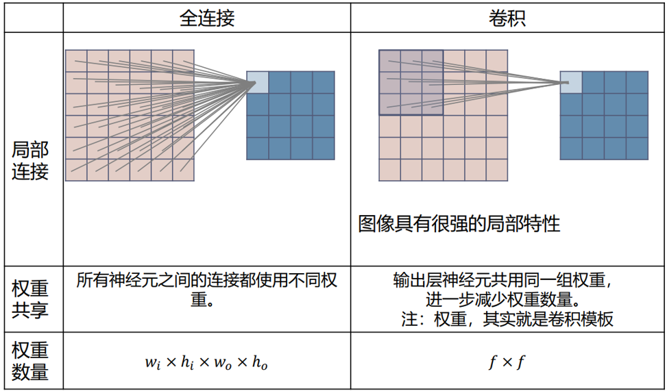
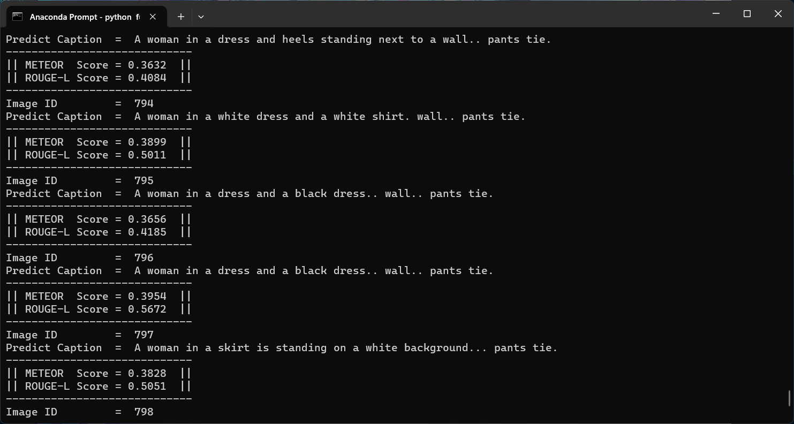
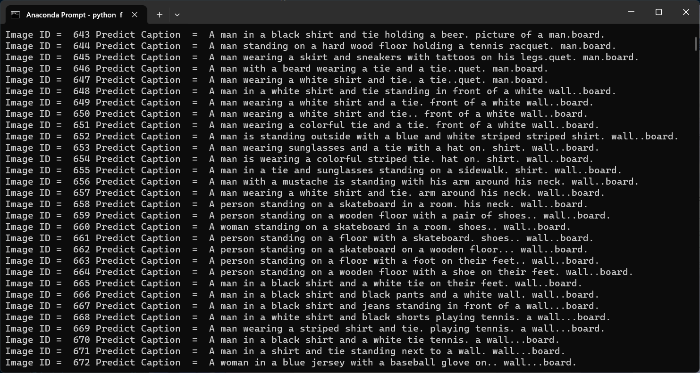
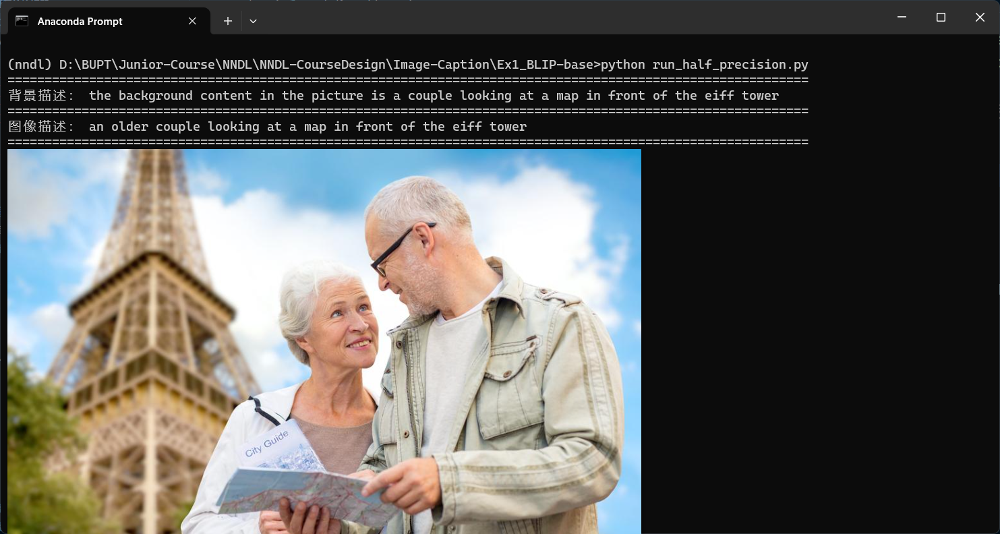

## 结题报告——Image Caption

> 2023 秋季北京邮电大学深度学习与神经网络课程设计

## 一、任务说明
- 成员介绍：
    巩羽飞（负责人）、黄成梓（组员）

- 任务分工：
  - **巩羽飞**：实现了`网格/区域表示、Transformer编码器+Transformer解码器`的模型结构并成功在DeepFashion-MultiModal 数据集上进行训练；实现了METEOR、ROUGE-L评测标准；实现了基于强化学习的损失函数；微调多模态模型BLIP并成功测试其性能；利用训练的服饰图像描述模型和多模态大语言模型，为真实背景的服饰图像数据集增加服饰描述和背景描述，构建全新的服饰图像描述数据集。
  - **黄成梓**：实现了`网格/区域表示、自注意力+注意力`的模型结构并成功在DeepFashion-MultiModal 数据集上进行训练；实现了CIDEr-D评测标准；实现了基于强化学习的损失函数，直接优化CIDEr-D评测标准，使模型的效果得到显著的提升；利用训练的服饰图像描述模型为真实背景的服饰图像数据集增加服饰描述，构建全新的服饰图像描述数据集；在新数据集上重新训练服饰图像描述模型。
- 任务完成情况：
    小组成员全部完成各自的分工，**完成了所有的必选任务和可选任务**。具体的代码放在了GitHub中：`https://github.com/Conqueror712/Image-Caption`

## 二、实验数据

### 2.1 原始数据

我们使用了 DeepFashion-MultiModal 数据集中 image 和 textual descriptions 的数据，其中 80% 的数据作为模型的训练集，20% 作为模型的测试集。数据集的 Github Repo 如下：

>  https://github.com/yumingj/DeepFashion-MultiModal

由于数据对应的 json 文件已经提前划分好，但是 images 文件夹仍然是混合在一起的，所以我们编写了一个 Python 脚本用于将 images 划分为 train_images 和 test_images，如下所示：

```Python
# 读取json文件并转换为字典
with open('../../data/test_captions.json', 'r') as f:
    test_captions = json.load(f)

with open('../../data/train_captions.json', 'r') as f:
    train_captions = json.load(f)

# 指定源目录和目标目录
source_directory = '../../data/images'
train_directory = '../../data/train_images'
test_directory = '../../data/test_images'

# 确保目标目录存在
os.makedirs(train_directory, exist_ok=True)
os.makedirs(test_directory, exist_ok=True)

# 将训练集图片复制到目标目录
for image in train_captions:
    shutil.copy(os.path.join(source_directory, image), train_directory)

# 将测试集图片复制到目标目录
for image in test_captions:
    shutil.copy(os.path.join(source_directory, image), test_directory)
```

另外，我们还发现图像的关键点信息并没有在 json 文件中显示，而是在图像的文件名中，所以我们**通过正则表达式，提取了每张图像的关键点信息**，并更新了 json 文件，如下所示：

```Python
# 定义一个函数来解析文件名
def parse_filename(filename):
    # 使用正则表达式匹配文件名
    pattern = r'^(?P<gender>\w+)-(?P<clothing>[\w_]+)-id_(?P<id>\d+)-(?P<group>\d+)_(\d+_(?P<body>\w+))\.jpg$'
    match = re.match(pattern, filename)
    if match:
        return match.groupdict()
    else:
        return None

# 定义一个函数来处理目录中的所有文件
def process_directory(directory):
    # 创建一个字典来存储结果
    results = {}
    # 遍历目录中的所有文件
    for filename in os.listdir(directory):
        # 解析文件名
        info = parse_filename(filename)
        if info:
            # 将解析的信息与文件名关联起来
            results[filename] = info
    return results

# 使用函数处理目录
directory = '../../data/images'
results = process_directory(directory)

# 将结果保存到json文件中
with open('../../data/label.json', 'w') as f:
    json.dump(results, f, ensure_ascii=False, indent=4)
```

### 2.2 背景描述增量数据

我们使用老师在群里提供的数据。

> https://pan.baidu.com/s/1qN3EEUNXh4nUcNZMCoT9Fg?pwd=rnfw (rnfw)

同样地，我们将其重命名并划分为 train_images 和 test_images，比例为 9:1。


图片重命名的代码片段如下：

```Python
def rename_images(folder_path):
    # 检查文件夹是否存在
    if not os.path.exists(folder_path):
        print(f"文件夹 '{folder_path}' 不存在。")
        return

    # 获取文件夹下所有文件
    files = os.listdir(folder_path)

    # 迭代处理每个文件
    for index, file_name in enumerate(files):
        old_path = os.path.join(folder_path, file_name)
        new_name = f"train_{index + 1}.jpg"
        new_path = os.path.join(folder_path, new_name)
        os.rename(old_path, new_path)
        print(f"重命名文件: {file_name} -> {new_name}")
```

## 三、实验环境

- Ubuntu 20.04 / Ubuntu 22.04 / Windows 11
- NVIDIA GPU and NVIDIA CUDA Driver
- CUDA 12.2 / CUDA 11.8
- Python 3.10

具体的第三方库依赖请见 `requirements.txt`

## 四、模型选择

首先，作为共性特点，我们先来介绍一下基于编解码器的方法：

随着深度学习技术的不断发展，神经网络在计算机视觉和自然语言处理领域得到了广泛应用。受机器翻译领域中编解码器模型的启发，图像描述可以通过端到端的学习方法直接实现图像和描述句子之间的映射，将图像描述过程转化成为图像到描述的"翻译"过程。**基于深度学习的图像描述生成方法大多采用以 CNN-RNN 为基本模型的编解码器框架，CNN 决定了整个模型的图像识别能力，其最后的隐藏层的输出被用作解码器的输入，RNN 是用来读取编码后的图像并生成文本描述的网络模型**，下图是一个简单递归神经网络 RNN 和多模态递归神经网络 m-RNN 架构的示意图：


之所以是 CNN 决定了整个模型的图像识别能力，RNN 被用来读取编码后的图像并生成文本描述的网络模型，是因为计算机视觉问题有很强的局部特征，即一个像素和它周围的旁边几个像素有很强的关联性，但是离他非常远的像素之间的关联性就比较弱，所以只需要像 CNN 一样在局部做连接，而不需要像全连接网络一样每一层之间都是全连接的，从而大大降低了权重的数量。而 RNN 通过使用带自反馈的神经元，也就是隐藏状态，能够处理任意长度的序列数据，可以有效保存序列数据的历史信息。




### 4.1 网格/区域表示、自注意力+注意力的模型结构：

近年来，注意力机制被广泛应用于计算机视觉领域，其本质是为了解决编解码器在处理固定长度向量时的局限性。注意力机制并不是将输入序列编码成一个固定向量，而是通过增加一个上下文向量来对每个时间步的输入进行解码，以增强图像区域和单词的相关性，从而获取更多的图像语义细节，下图是一个学习单词 / 图像对齐过程的示意图：


#### 4.1.1 参数配置：

我在`configurations.py` 文件中定义了 `Config` 类作为项目的配置中心来集中管理项目中使用的所有配置参数。这些参数通常包括文件路径、模型参数、数据处理选项、训练设置和图像处理参数等。通过这种方式，可以在不修改代码的情况下调整项目的行为。以下是 `Config` 类中定义的配置参数及其作用：

1. **数据路径**：
   - `data_path`：主数据目录路径。
   - `images_path`：存储图像的路径。
   - `train_captions_path`：训练集的文本描述文件路径。
   - `test_captions_path`：测试集的文本描述文件路径。
   - `output_folder`：用于存储词汇表和处理后数据的输出文件夹路径。

2. **模型参数**：
   - `embed_size`：嵌入向量的维度。
   - `vocab_size`：词汇表的大小。
   - `num_layers`：定义循环神经网络中的层数。
   - `num_heads`：自注意力机制中头的数量。
   - `dropout`：在模型中使用的 Dropout 比率。
   - `hidden_size`：隐藏层的维度。
   - `image_code_dim`：图像编码的维度。
   - `word_dim`：词嵌入的维度。
   - `attention_dim`：注意力机制的隐藏层维度。

3. **数据处理参数**：
   - `min_word_count`：词汇表中词的最小出现次数，用于筛选词汇。
   - `max_len`：假设的描述的最大长度。

4. **训练参数**：
   - `batch_size`：每个批次的大小。
   - `learning_rate`：学习率。
   - `num_epochs`：训练的总轮次数。
   - `workers`：加载数据时使用的工作线程数。
   - `encoder_learning_rate`：编码器的学习率。
   - `decoder_learning_rate`：解码器的学习率。
   - `lr_update`：学习率更新频率。

5. **图像预处理参数**：
   - `image_size`：图像缩放后的大小。
   - `crop_size`：从缩放后的图像中裁剪出的大小。

6. **其他配置**：
   - `device`：设置运行计算的设备，如果 CUDA 可用则使用 GPU，否则使用 CPU。

#### 4.1.2 数据预处理：

我定义了一个python文件`datasets.py`，其定义一个完整的流程，用于创建和处理一个基于图像和文本描述的`DeepFashion-MultiModal` 数据集

1. `create_dataset` 函数：用于处理原始文本描述，创建一个词汇表，并将文本转换为对应的词索引向量。它首先读取训练和测试数据集中的文本描述，然后统计词频以创建词汇表，并移除低频词。之后，它定义了一个内部函数 `encode_captions`，这个函数负责将每条文本描述转换为一个固定长度的词索引序列，包括特殊标记 <start>, <end>, <pad>, 和 <unk>。转换完成后，函数将这些数据保存为 json 文件，以便后续处理。关键代码展示如下：

    ```Python
    def create_dataset(max_len=64):
        """
        整理数据集，构建词汇表，并将文本描述转换为词索引向量。
        使用configuration.py文件中定义的配置信息。
        """
        # 使用config中定义的路径
        image_folder = config.images_path
        train_captions_path = config.train_captions_path
        test_captions_path = config.test_captions_path
        output_folder = config.output_folder
    
        # 读取训练图像描述
        with open(train_captions_path, 'r') as f:
            train_captions_data = json.load(f)
    
        # 读取测试图像描述
        with open(test_captions_path, 'r') as f:
            test_captions_data = json.load(f)
    
        # 统计训练集的文本描述的词频
        vocab = Counter()
        for caption in train_captions_data.values():
            vocab.update(caption.lower().split())
    
        # 移除其中的低频词
        vocab = {word for word, count in vocab.items() if count >= config.min_word_count}
    
        # 构建词典
        word_to_idx = {word: idx + 4 for idx, word in enumerate(vocab)}
        word_to_idx['<pad>'] = 0
        word_to_idx['<start>'] = 1
        word_to_idx['<end>'] = 2
        word_to_idx['<unk>'] = 3
    
        # 一个函数来转换描述为词索引向量，并进行填充
        def encode_captions(captions_data, word_to_idx, max_len):
            encoded_captions = {}
            caplens = {}
            for img_id, caption in captions_data.items():
                words = caption.lower().split()
                encoded_caption = [word_to_idx.get(word, word_to_idx['<unk>']) for word in words]
                caplen = len(encoded_caption) + 2  # 加2是因为还要加上<start>和<end>
                encoded_caption = [word_to_idx['<start>']] + encoded_caption + [word_to_idx['<end>']]
                encoded_caption += [word_to_idx['<pad>']] * (max_len - len(encoded_caption))
                encoded_captions[img_id] = encoded_caption[:max_len]
                caplens[img_id] = caplen if caplen <= max_len else max_len
            return encoded_captions, caplens
    
        # 对训练集描述进行编码
        encoded_captions_train, caplens_train = encode_captions(train_captions_data, word_to_idx, max_len)
    
        # 对测试集描述进行编码
        encoded_captions_test, caplens_test = encode_captions(test_captions_data, word_to_idx, max_len)
    
        # 存储词典和编码后的描述
        with open(os.path.join(output_folder, 'vocab.json'), 'w') as f:
            json.dump(word_to_idx, f)
    
        with open(os.path.join(output_folder, 'encoded_captions_train.json'), 'w') as f:
            json.dump(encoded_captions_train, f)
    
        with open(os.path.join(output_folder, 'encoded_captions_test.json'), 'w') as f:
            json.dump(encoded_captions_test, f)
    
        # 存储图像路径
        image_paths_train = {img_id: os.path.join(image_folder, img_id) for img_id in train_captions_data.keys()}
        with open(os.path.join(output_folder, 'image_paths_train.json'), 'w') as f:
            json.dump(image_paths_train, f)
    
        image_paths_test = {img_id: os.path.join(image_folder, img_id) for img_id in test_captions_data.keys()}
        with open(os.path.join(output_folder, 'image_paths_test.json'), 'w') as f:
            json.dump(image_paths_test, f)
    
        # 存储caplens
        with open(os.path.join(output_folder, 'caplens_train.json'), 'w') as f:
            json.dump(caplens_train, f)
    
        with open(os.path.join(output_folder, 'caplens_test.json'), 'w') as f:
            json.dump(caplens_test, f)
    ```

2. `ImageTextDataset` 类：继承自 `torch.utils.data.Dataset`，这个类是一个 PyTorch 的自定义数据集，用于加载图像和对应的已编码文本描述。它重写了 `__getitem__` 方法，用于获取索引对应的数据点（图像和文本描述），并将图像通过转换处理成统一的格式；重写了 `__len__` 方法，返回数据集的大小，关键代码展示如下：
    ```Python
    class ImageTextDataset(Dataset):
        """
        PyTorch数据集类，用于加载和处理图像-文本数据。
        """
    
        def __init__(self, image_paths_file, captions_file, caplens_file, transform=None):
            """
            初始化数据集类。
            参数:
                image_paths_file: 包含图像路径的json文件路径。
                captions_file: 包含编码后文本描述的json文件路径。
                transform: 应用于图像的预处理转换。
            """
            # 载入图像路径和文本描述以及caplens
            with open(image_paths_file, 'r') as f:
                self.image_paths = json.load(f)
    
            with open(captions_file, 'r') as f:
                self.captions = json.load(f)
    
            with open(caplens_file, 'r') as f:
                self.caplens = json.load(f)
    
            # 设置图像预处理方法
            self.transform = transform or transforms.Compose([
                transforms.Resize((256, 256)),
                transforms.ToTensor(),
                transforms.Normalize(mean=[0.485, 0.456, 0.406], std=[0.229, 0.224, 0.225])
            ])
    
        def __getitem__(self, index):
            """
            获取单个数据点。
            参数:
                index: 数据点的索引。
            返回:
                一个包含图像和对应文本描述的元组。
            """
            # 获取图像路径和文本描述以及caplen
            image_id = list(self.image_paths.keys())[index]
            image_path = self.image_paths[image_id]
            caption = self.captions[image_id]
            caplen = self.caplens[image_id]
    
            # 加载图像并应用预处理
            image = Image.open(image_path).convert('RGB')
            if self.transform is not None:
                image = self.transform(image)
    
            # 将文本描述转换为张量
            caption_tensor = torch.tensor(caption, dtype=torch.long)
    
            return image, caption_tensor, caplen
    
        def __len__(self):
            """
            数据集中的数据点总数。
            """
            return len(self.image_paths)
    ```

3. `create_dataloaders` 函数：使用 `ImageTextDataset` 类来创建PyTorch的 `DataLoader`，它提供了一个可迭代的数据加载器，用于在训练和测试时批量加载数据，并可选地对数据进行打乱和多进程加载，关键代码展示如下：

    ```Python
    # 创建训练集和测试集的 DataLoader
    def create_dataloaders(config):
        """
        创建训练集和测试集的 DataLoader。
    
        参数:
            batch_size: 每个批次的大小。
            num_workers: 加载数据时使用的进程数。
            shuffle_train: 是否打乱训练数据。
    
        返回:
            train_loader: 训练数据的 DataLoader。
            test_loader: 测试数据的 DataLoader。
        """
        # 图像预处理转换
        transform = transforms.Compose([
            transforms.Resize((256, 256)),
            transforms.RandomCrop(224),
            transforms.ToTensor(),
            transforms.Normalize(mean=[0.485, 0.456, 0.406], std=[0.229, 0.224, 0.225])
        ])
    
        # 加载数据时使用的进程数
        num_workers = 0
    
        # 创建数据集对象
        train_dataset = ImageTextDataset(
            image_paths_file=os.path.join(config.output_folder, 'image_paths_train.json'),
            captions_file=os.path.join(config.output_folder, 'encoded_captions_train.json'),
            caplens_file=os.path.join(config.output_folder, 'caplens_train.json'),
            transform=transform
        )
    
        test_dataset = ImageTextDataset(
            image_paths_file=os.path.join(config.output_folder, 'image_paths_test.json'),
            captions_file=os.path.join(config.output_folder, 'encoded_captions_test.json'),
            caplens_file=os.path.join(config.output_folder, 'caplens_test.json'),
            transform=transform
        )
    
        # 创建 DataLoader 对象
        train_loader = DataLoader(
            dataset=train_dataset,
            batch_size=config.batch_size,
            shuffle=True,
            num_workers=num_workers,
            pin_memory=True
        )
    
        test_loader = DataLoader(
            dataset=test_dataset,
            batch_size=config.batch_size,
            shuffle=False,  # 通常测试集不需要打乱
            num_workers=num_workers,
            pin_memory=True
        )
    
        return train_loader, test_loader
    ```

4. 我还定义了一个 `datasets_pretrain_demo.py` 文件来验证数据预处理过程是否正确。它通过以下步骤实现这一目标：

    - 读取词汇表和编码后的描述：加载之前生成的词汇表 `vocab.json`，编码后的训练集描述 `encoded_captions_train.json`，以及训练图像的路径 `image_paths_train.json`。
    - 索引到单词的转换： 创建从词索引到单词的反向映射，用于将编码后的描述转换回文本形式。
    - 选择并展示图像： 从图像路径列表中选择第一个图像 ID，并加载对应的图像。
    - 展示图像：使用 matplotlib 展示图像，并关闭坐标轴。
    - 打印文本描述：将编码后的描述（词索引列表）转换回单词形式，并打印出来，以验证编码和图像加载的正确性。
    
    ```Python
    import json
    from PIL import Image
    import matplotlib.pyplot as plt
    
    vocab_path = '../data/output/vocab.json'
    encoded_captions_path = '../data/output/encoded_captions_train.json'
    image_paths_path = '../data/output/image_paths_train.json'
    
    # 读取词典、编码后的描述和图像路径
    with open(vocab_path, 'r') as f:
        vocab = json.load(f)
    
    with open(encoded_captions_path, 'r') as f:
        encoded_captions = json.load(f)
    
    with open(image_paths_path, 'r') as f:
        image_paths = json.load(f)
    
    # 将索引转换回单词
    vocab_idx2word = {idx: word for word, idx in vocab.items()}
    
    # 选择要展示的图片ID，这里以第一个ID为例
    first_img_id = list(image_paths.keys())[0]
    content_img = Image.open(image_paths[first_img_id])
    
    # 展示图片和对应的描述
    plt.imshow(content_img)
    plt.axis('off')  # 不显示坐标轴
    plt.show()
    
    # 打印对应的文本描述，确保字典中的键是整数，直接使用整数索引
    caption = ' '.join([vocab_idx2word[word_idx] for word_idx in encoded_captions[first_img_id]])
    print(caption)
    ```

#### 4.1.3 模型定义

我的 `models.py` 文件定义了用于服饰图像描述任务的神经网络模型，包括图像编码器、注意力机制、文本解码器、整体模型框架和损失函数。以下是代码中各个部分的详细作用：

1. **自注意力机制** `SelfAttention` 类：定义了一个利用 `nn.MultiheadAttention` 实现的自注意力层。它可以处理图像的特征，使模型能够在图像的不同区域之间建立联系，这在解析复杂图像时非常有用。

    ```Python
    # 引入自注意机制后的图像编码器
    class SelfAttention(nn.Module):
        def __init__(self, num_channels, num_heads=8, dropout=0.1):
            super(SelfAttention, self).__init__()
            self.num_heads = num_heads
            self.attention = nn.MultiheadAttention(num_channels, num_heads, dropout)
    
        def forward(self, x):
            # 保存原始形状
            orig_shape = x.shape
            # 打印输入形状
            print("Input shape:", x.shape)
            # 转换为(sequence_length, batch_size, num_channels)格式
            x = x.flatten(2).permute(2, 0, 1)
            attention_output, _ = self.attention(x, x, x)
            # 还原形状，确保与原始输入形状匹配
            attention_output = attention_output.permute(1, 2, 0)# 打印最终输出形状
            print("Final output shape:", attention_output.shape)
            return attention_output.view(orig_shape)
    ```

2. 图像编码器 `ImageEncoder` 类：使用预训练的 ResNet-101 模型作为特征提取器，抽取图像的高层特征。**这些特征接着被自注意力层进一步处理，以增强图像区域间的相关性**。

    ```Python
    class ImageEncoder(nn.Module):
        def __init__(self, finetuned=True, num_heads=8, dropout=0.1):
            super(ImageEncoder, self).__init__()
            # 使用ResNet101作为基础模型
            model = resnet101(weights=ResNet101_Weights.DEFAULT)
            self.grid_rep_extractor = nn.Sequential(*(list(model.children())[:-2]))
            # 设置参数是否可训练
            for param in self.grid_rep_extractor.parameters():
                param.requires_grad = finetuned
    
            # 自注意力层
            self.self_attention = SelfAttention(model.fc.in_features, num_heads, dropout)
    
        def forward(self, images):
            # 通过ResNet网格表示提取器
            features = self.grid_rep_extractor(images)
            print("Extractor output shape:", features.shape)
            # 应用自注意力
            features = self.self_attention(features)
            # 打印自注意力输出形状
            print("Self-attention output shape:", features.shape)
            return features
    ```

3. 解码器的注意力机制 `AdditiveAttention` 类：实现了一种加法（或称为 Bahdanau）注意力机制，用于计算解码过程中的上下文向量。它通过比较解码器的隐藏状态（query）与图像编码（key-value）之间的关系来计算每个位置的注意力权重。

    ```Python
    # 解码器的注意力机制
    class AdditiveAttention(nn.Module):
        def  __init__(self, query_dim, key_dim, attn_dim):
            """
            参数：
                query_dim: 查询Q的维度
                key_dim: 键K的维度
                attn_dim: 注意力函数隐藏层表示的维度
            """
            super(AdditiveAttention, self).__init__()
            self.attn_w_1_q = nn.Linear(query_dim, attn_dim)
            self.attn_w_1_k = nn.Linear(key_dim, attn_dim)
            self.attn_w_2 = nn.Linear(attn_dim, 1)
            self.tanh = nn.Tanh()
            self.softmax = nn.Softmax(dim=1)
    
        def forward(self, query, key_value):
            """
            Q K V：Q和K算出相关性得分，作为V的权重，K=V
            参数：
                query: 查询 (batch_size, q_dim)
                key_value: 键和值，(batch_size, n_kv, kv_dim)
            """
            queries = self.attn_w_1_q(query).unsqueeze(1)
            keys = self.attn_w_1_k(key_value)
            attn = self.attn_w_2(self.tanh(queries+keys)).squeeze(2)
            attn = self.softmax(attn)
            output = torch.bmm(attn.unsqueeze(1), key_value).squeeze(1)
            return output, attn
    ```

4. 文本解码器 `AttentionDecoder` 类：定义了一个注意力机制的解码器，它结合了图像编码和前一个时间步的词嵌入来生成文本描述。解码器使用 GRU 单元进行序列生成，并且在每个时间步使用注意力权重来关注图像的不同区域，代码的关键在于使用`padded_predictions`来处理变长序列：

**在生成文本描述时，不同的描述可能具有不同的长度。为了有效地处理这种变长序列，`padded_predictions` 被用来确保所有的输出序列具有相同的长度**。这样做对于批量处理和后续的损失计算至关重要。通过在`AttentionDecoder`中使用 `padded_predictions` 我们可以保证：

- **确保统一长度**:
  将所有的预测结果（即文本描述）填充到相同的最大长度。这是通过找出批次中最长的描述并将所有其他描述填充到这个长度来实现的。

- **填充逻辑**:
  对于每个描述，它只拷贝实际长度的预测结果到 `padded_predictions` 张量中。对于不足最大长度的部分，保持为零（默认填充值）。

- **处理变长序列**:
  这种填充方法允许模型处理变长的输出序列，同时保持批处理操作的一致性和效率。

- **后续处理**:
  `padded_predictions` 的使用使得后续的操作，如计算损失函数或评估模型性能，变得更加简单和直接，因为所有输出序列都有相同的维度。

文本解码器 `AttentionDecoder`函数的关键代码如下所示：

    ```Python
    # 文本解码器
    class AttentionDecoder(nn.Module):
        """
               初始化文本解码器。
    
               参数:
                   image_code_dim: 图像编码的维度。
                   vocab_size: 词汇表的大小。
                   word_dim: 词嵌入的维度。
                   attention_dim: 注意力机制的隐藏层维度。
                   hidden_size: GRU隐藏层的大小。
                   num_layers: GRU层数。
                   dropout: Dropout层的概率。
        """
        def forward(self, image_code, captions, cap_lens):
        """
        完整的前馈过程。
        参数：
            hidden_state: (num_layers, batch_size, hidden_size)
            image_code:  (batch_size, feature_channel, feature_size)
            captions: (batch_size, )
        """
        image_code, captions, sorted_cap_lens, sorted_cap_indices, hidden_state \
            = self.init_hidden_state(image_code, captions, cap_lens)
        batch_size = image_code.size(0)
        # 输入序列长度减1，因为最后一个时刻不需要预测下一个词
        lengths = sorted_cap_lens.cpu().numpy() - 1
        # 初始化变量：模型的预测结果和注意力分数
        max_cap_len = max(cap_lens)  # 计算最长caption的长度
        predictions = torch.zeros(batch_size, max_cap_len, self.fc.out_features).to(captions.device)
        alphas = torch.zeros(batch_size, max_cap_len, image_code.shape[1]).to(captions.device)
        cap_embeds = self.embed(captions)
        for step in range(lengths[0]):
            real_batch_size = np.where(lengths > step)[0].shape[0]
            preds, alpha, hidden_state = self.forward_step(
                image_code[:real_batch_size],
                cap_embeds[:real_batch_size, step, :],
                hidden_state[:, :real_batch_size, :].contiguous())
            # 记录结果
            predictions[:real_batch_size, step, :] = preds
            alphas[:real_batch_size, step, :] = alpha
            max_cap_len = max(cap_lens)
            # 初始化一个填充的predictions张量
            padded_predictions = torch.zeros(batch_size, max_cap_len, self.fc.out_features).to(predictions.device)
            for i in range(batch_size):
                # 当前样本的实际长度
                actual_length = cap_lens[i]
                # 只拷贝实际长度的预测结果
                padded_predictions[i, :actual_length, :] = predictions[i, :actual_length, :]
        return padded_predictions, alphas, captions, lengths, sorted_cap_indices
    ```

5. `AttentionModel`类：将图像编码器和文本解码器整合在一起，定义了完整的模型流程。在前向传递过程中，模型接受图像和文本描述，利用编码器和解码器生成描述的输出。通过引入`注意力机制`，使模型能够聚焦于输入图像的不同部分，根据图像的内容动态调整生成描述的重点；采用`束搜索算法`,考虑多个候选续词，并从中选取概率最高的几个以继续生成过程。这提高了生成文本的质量和相关性。其关键代码如下所示：
    ```Python
    class AttentionModel(nn.Module):
    def __init__(self, image_code_dim, vocab, word_dim, attention_dim, hidden_size, num_layers):
        pass

    def forward(self, images, captions, cap_lens):
        pass

    def generate_by_beamsearch(self, images, beam_k, max_len):
        vocab_size = len(self.vocab)
        image_codes = self.encoder(images)
        texts = []
        device = images.device
        # 对每个图像样本执行束搜索
        for image_code in image_codes:
            # 将图像表示复制k份
            image_code = image_code.unsqueeze(0).repeat(beam_k, 1, 1, 1)
            # 生成k个候选句子，初始时，仅包含开始符号<start>
            cur_sents = torch.full((beam_k, 1), self.vocab['<start>'], dtype=torch.long).to(device)
            cur_sent_embed = self.decoder.embed(cur_sents)[:, 0, :]
            sent_lens = torch.LongTensor([1] * beam_k).to(device)
            # 获得GRU的初始隐状态
            image_code, cur_sent_embed, _, _, hidden_state = \
                self.decoder.init_hidden_state(image_code, cur_sent_embed, sent_lens)
            # 存储已生成完整的句子（以句子结束符<end>结尾的句子）
            end_sents = []
            # 存储已生成完整的句子的概率
            end_probs = []
            # 存储未完整生成的句子的概率
            probs = torch.zeros(beam_k, 1).to(device)
            k = beam_k
            while True:
                preds, _, hidden_state = self.decoder.forward_step(image_code[:k], cur_sent_embed,hidden_state.contiguous())
                preds = nn.functional.log_softmax(preds, dim=1)
                # 对每个候选句子采样概率值最大的前k个单词生成k个新的候选句子，并计算概率
                probs = probs.repeat(1, preds.size(1)) + preds
                if cur_sents.size(1) == 1:
                    # 第一步时，所有句子都只包含开始标识符，因此，仅利用其中一个句子计算topk
                    values, indices = probs[0].topk(k, 0, True, True)
                else:
                    # probs: (k, vocab_size) 是二维张量
                    # topk函数直接应用于二维张量会按照指定维度取最大值，这里需要在全局取最大值
                    # 因此，将probs转换为一维张量，再使用topk函数获取最大的k个值
                    values, indices = probs.view(-1).topk(k, 0, True, True)
                # 计算最大的k个值对应的句子索引和词索引
                sent_indices = torch.div(indices, vocab_size, rounding_mode='trunc')
                word_indices = indices % vocab_size
                # 将词拼接在前一轮的句子后，获得此轮的句子
                cur_sents = torch.cat([cur_sents[sent_indices], word_indices.unsqueeze(1)], dim=1)
                # 查找此轮生成句子结束符<end>的句子
                end_indices = [idx for idx, word in enumerate(word_indices) if word == self.vocab['<end>']]
                if len(end_indices) > 0:
                    end_probs.extend(values[end_indices])
                    end_sents.extend(cur_sents[end_indices].tolist())
                    # 如果所有的句子都包含结束符，则停止生成
                    k -= len(end_indices)
                    if k == 0:
                        break
                # 查找还需要继续生成词的句子
                cur_indices = [idx for idx, word in enumerate(word_indices)
                               if word != self.vocab['<end>']]
                if len(cur_indices) > 0:
                    cur_sent_indices = sent_indices[cur_indices]
                    cur_word_indices = word_indices[cur_indices]
                    # 仅保留还需要继续生成的句子、句子概率、隐状态、词嵌入
                    cur_sents = cur_sents[cur_indices]
                    probs = values[cur_indices].view(-1, 1)
                    hidden_state = hidden_state[:, cur_sent_indices, :]
                    cur_sent_embed = self.decoder.embed(
                        cur_word_indices.view(-1, 1))[:, 0, :]
                # 句子太长，停止生成
                if cur_sents.size(1) >= max_len:
                    break
            if len(end_sents) == 0:
                # 如果没有包含结束符的句子，则选取第一个句子作为生成句子
                gen_sent = cur_sents[0].tolist()
            else:
                # 否则选取包含结束符的句子中概率最大的句子
                gen_sent = end_sents[end_probs.index(max(end_probs))]
            texts.append(gen_sent)
        return texts
    ```

6. 损失函数 `PackedCrossEntropyLoss` 类：为序列学习任务定义了交叉熵损失函数，忽略填充的部分。它使用了 `pack_padded_sequence` 来处理不同长度的序列。

    ```Python
    # 损失函数
    class PackedCrossEntropyLoss(nn.Module):
        def __init__(self):
            pass
    
        def forward(self, predictions, targets, lengths):
            """
            计算交叉熵损失，排除填充的部分。
            参数：
                predictions：模型的预测结果，形状为 (batch_size, max_length, vocab_size)。
                targets：实际的文本描述，形状为 (batch_size, max_length)。
                lengths：每个描述的实际长度。
            """
            packed_predictions = pack_padded_sequence(predictions, lengths, batch_first=True, enforce_sorted=False)[0]
            packed_targets = pack_padded_sequence(targets, lengths, batch_first=True, enforce_sorted=False)[0]
    
            # 计算损失，忽略填充的部分
            loss = self.loss_fn(packed_predictions, packed_targets)
            return loss
    ```

7. `evaluate_cider`类：评估一个图像描述生成模型的性能，使用 CIDEr-D（Consensus-based Image Description Evaluation - D）评分来衡量模型生成的文本描述与实际（参考）描述之间的一致性。首先使用`filter_useless_words` 函数去除无用词汇 （如 '<start>', '<end>', '<pad>'），之后再进行模型评估，接着生成描述并准备评估数据，最后组织评估数据并计算 CIDEr-D 得分。其关键代码如下所示：

```python
def filter_useless_words(sent, filterd_words):
    # 去除句子中不参与CIDEr-D计算的符号
    return [w for w in sent if w not in filterd_words]

def evaluate_cider(data_loader, model, config):
    model.eval()
    # 存储候选文本和参考文本
    cands = {}
    refs = {}
    filterd_words = {model.vocab['<start>'], model.vocab['<end>'], model.vocab['<pad>']}
    device = next(model.parameters()).device

    # 加载词汇表并创建反向词汇表
    with open('../data/output/vocab.json', 'r') as f:
        vocab = json.load(f)
    idx_to_word = {idx: word for word, idx in vocab.items()}

    for i, (imgs, caps, caplens) in enumerate(data_loader):
        imgs = imgs.to(device)
        # 通过束搜索生成描述
        preds = model.generate_by_beamsearch(imgs, config.beam_k, config.max_len)
        for j in range(imgs.size(0)):
            img_id = str(i * config.batch_size + j)
            cand_words = [idx_to_word.get(word, '<unk>') for word in preds[j]]
            cand = ' '.join(filter_useless_words(cand_words, filterd_words))
            cands[img_id] = [cand]  # 候选描述
            # 将参考描述（caps[j]）的每个索引转换为单词
            ref_words = [idx_to_word.get(word.item(), '<unk>') for word in caps[j]]
            refs[img_id] = [' '.join(filter_useless_words(ref_words, filterd_words))]  # 参考描述
    # 计算CIDEr-D得分
    cider_evaluator = Cider()
    score, _ = cider_evaluator.compute_score(refs, cands)
    model.train()
    return score
```


### 4.2 网格/区域表示、Transformer编码器+Transformer解码器的模型结构：

Transformer Model 整体架构图：


我们首先使用 argparse 库解析命令行参数，获取图像路径、模型版本和 Checkpoint 路径；其次根据命令行参数加载预训练模型，或者从 Checkpoint 加载模型（可选）；紧接着使用 PIL 库打开图像，并进行预处理；然后使用模型生成图像的描述；最后使用 METEOR 和 ROUGE-L 评估生成的描述与参考描述的相似度。

我们定义了一个名为 `MyDataset` 的类，这个类继承自 PyTorch 的 `Dataset` 基类。在 `init` 方法中，这个类接受一个 json 文件的路径、一个图像目录的路径和一个可选的图像转换函数。json 文件中应该包含图像文件名和对应的标题。这个方法首先读取 json 文件并将其内容保存在 `self.data` 中，然后保存图像目录的路径和图像转换函数。最后，它从 `self.data` 中提取所有的文件名并保存在 `self.filenames` 中。`__len__` 方法返回数据集中的样本数量，这是通过返回 `self.data` 的长度来实现的。`__getitem__` 方法接受一个索引 `idx`，并返回对应的图像和标题。它首先从 `self.filenames` 中获取文件名，然后从 `self.data` 中获取对应的标题。接着，它打开对应的图像文件，并如果提供了图像转换函数，就对图像进行转换。最后，它返回图像和标题。

```Python
class MyDataset(Dataset):
    def __init__(self, json_file, img_dir, transform=None):
        with open(json_file, 'r') as f:
            self.data = json.load(f)
        self.img_dir = img_dir
        self.transform = transform
        self.filenames = list(self.data.keys())

    def __len__(self):
        return len(self.data)

    def __getitem__(self, idx):
        filename = self.filenames[idx]
        caption = self.data[filename]
        image = Image.open(f"{self.img_dir}/{filename}")
        if self.transform:
            image = self.transform(image)
        return image, caption
```

#### 4.2.1 参数解析模块

解析命令行参数，获取图像路径、模型版本和 Checkpoint 路径。

```Python
parser = argparse.ArgumentParser(description='Image Captioning')
parser.add_argument('--path', type=str, help='path to image',
required=True)
parser.add_argument('--v', type=str, help='version')
parser.add_argument('--checkpoint', type=str, help='checkpointpath', default=None)
args = parser.parse_args()
image_path = args.path
version = args.v
checkpoint_path = args.checkpoint
```

#### 4.2.2 图像预处理模块

使用 PIL 库打开图像，并进行预处理。

```Python
start_token = tokenizer.convert_tokens_to_ids(tokenizer._cls_token)
end_token = tokenizer.convert_tokens_to_ids(tokenizer._sep_token)
image = Image.open(image_path)
image = coco.val_transform(image)
image = image.unsqueeze(0)
```

#### 4.2.3 Caption 生成模块

顾名思义，使用模型生成图像的描述。我们使用了骨干网络提取图像特征，Transformer 处理序列数据，而最终的标注生成则通过一个简单的多层感知机完成。

```Python
class Caption(nn.Module):
    def __init__(self, backbone, transformer, hidden_dim, vocab_size):
        super().__init__()
        self.backbone = backbone
        self.input_proj = nn.Conv2d(
            backbone.num_channels, hidden_dim, kernel_size=1)
        self.transformer = transformer
        self.mlp = MLP(hidden_dim, 512, vocab_size, 3)

    def forward(self, samples, target, target_mask):
        if not isinstance(samples, NestedTensor):
            samples = nested_tensor_from_tensor_list(samples)

        features, pos = self.backbone(samples)
        src, mask = features[-1].decompose()

        assert mask is not None

        hs = self.transformer(self.input_proj(src), mask,
                              pos[-1], target, target_mask)
        out = self.mlp(hs.permute(1, 0, 2))
        return out


class MLP(nn.Module):
    """ Very simple multi-layer perceptron (also called FFN)"""

    def __init__(self, input_dim, hidden_dim, output_dim, num_layers):
        super().__init__()
        self.num_layers = num_layers
        h = [hidden_dim] * (num_layers - 1)
        self.layers = nn.ModuleList(nn.Linear(n, k)
                                    for n, k in zip([input_dim] + h, h + [output_dim]))

    def forward(self, x):
        for i, layer in enumerate(self.layers):
            x = F.relu(layer(x)) if i < self.num_layers - 1 else layer(x)
        return x


def build_model(config):
    backbone = build_backbone(config)
    transformer = build_transformer(config)

    model = Caption(backbone, transformer, config.hidden_dim, config.vocab_size)
    criterion = torch.nn.CrossEntropyLoss()

    return model, criterion

def create_caption_and_mask(start_token, max_length):
    caption_template = torch.zeros((1, max_length), dtype=torch.long)
    mask_template = torch.ones((1, max_length), dtype=torch.bool)
    caption_template[:, 0] = start_token
    mask_template[:, 0] = False
    return caption_template, mask_template

caption, cap_mask = create_caption_and_mask(start_token,
                                            config.max_position_embeddings)

def evaluate():
    model.eval()
    for i in range(config.max_position_embeddings - 1):
        predictions = model(image, caption, cap_mask)
        predictions = predictions[:, i, :]
        predicted_id = torch.argmax(predictions, axis=-1)
        if predicted_id[0] == 102:
		    return caption
        caption[:, i+1] = predicted_id[0]
        cap_mask[:, i+1] = False
    return caption
```

#### 4.2.4 Transformer模块

1. **Transformer类:**
    - 定义了一个包含编码器（`TransformerEncoder`）、解码器（`TransformerDecoder`）、嵌入层（`DecoderEmbeddings`）的整体Transformer模型。
    - 接受一些配置参数，如模型的维度（`d_model`）、头数（`nhead`）、层数等。
    - 在前向传播中，首先通过嵌入层处理目标序列（`tgt`），然后经过编码器和解码器，最终返回模型的输出。
```python
class Transformer(nn.Module):

    def __init__(self, config, d_model=512, nhead=8, num_encoder_layers=6,
                 num_decoder_layers=6, dim_feedforward=2048, dropout=0.1,
                 activation="relu", normalize_before=False,
                 return_intermediate_dec=False):
        super().__init__()

        encoder_layer = TransformerEncoderLayer(d_model, nhead, dim_feedforward,
                                                dropout, activation, normalize_before)
        encoder_norm = nn.LayerNorm(d_model) if normalize_before else None
        self.encoder = TransformerEncoder(
            encoder_layer, num_encoder_layers, encoder_norm)

        self.embeddings = DecoderEmbeddings(config)
        decoder_layer = TransformerDecoderLayer(d_model, nhead, dim_feedforward,
                                                dropout, activation, normalize_before)
        decoder_norm = nn.LayerNorm(d_model)
        self.decoder = TransformerDecoder(decoder_layer, num_decoder_layers, decoder_norm,
                                          return_intermediate=return_intermediate_dec)

        self._reset_parameters()

        self.d_model = d_model
        self.nhead = nhead

    def _reset_parameters(self):
        for p in self.parameters():
            if p.dim() > 1:
                nn.init.xavier_uniform_(p)

    def forward(self, src, mask, pos_embed, tgt, tgt_mask):
        # flatten NxCxHxW to HWxNxC
        bs, c, h, w = src.shape
        src = src.flatten(2).permute(2, 0, 1)
        pos_embed = pos_embed.flatten(2).permute(2, 0, 1)
        mask = mask.flatten(1)

        tgt = self.embeddings(tgt).permute(1, 0, 2)
        query_embed = self.embeddings.position_embeddings.weight.unsqueeze(1)
        query_embed = query_embed.repeat(1, bs, 1)

        memory = self.encoder(src, src_key_padding_mask=mask, pos=pos_embed)
        hs = self.decoder(tgt, memory, memory_key_padding_mask=mask, tgt_key_padding_mask=tgt_mask,
                          pos=pos_embed, query_pos=query_embed,
                          tgt_mask=generate_square_subsequent_mask(len(tgt)).to(tgt.device))
        return hs
```

2. **TransformerEncoder类:**
    - 该类继承自`nn.Module`，在其构造函数中接收一个编码器层（`encoder_layer`），以及编码器应该有的层数（`num_layers`）。还可选择性地包括一个层归一化组件（`norm`）。编码器的核心是其多层结构，由`_get_clones`函数实现，该函数创建了`encoder_layer`的多个副本，每个副本代表编码器的一个层。

   - 在编码器的`forward`方法中，实现了对输入数据（`src`）的处理。处理过程遍历每个编码器层，将数据连续传递给每个层，同时可能应用层归一化。编码器层处理数据时，可以考虑额外的掩码（`mask`），用于指定序列中哪些部分应被模型忽略，以及位置编码（`pos`），它为模型提供关于序列中各元素位置的信息。最后，如果定义了层归一化（`norm`），则在最终输出之前应用它。

```python
class TransformerEncoder(nn.Module):

    def __init__(self, encoder_layer, num_layers, norm=None):
        super().__init__()
        self.layers = _get_clones(encoder_layer, num_layers)
        self.num_layers = num_layers
        self.norm = norm

    def forward(self, src,
                mask: Optional[Tensor] = None,
                src_key_padding_mask: Optional[Tensor] = None,
                pos: Optional[Tensor] = None):
        output = src

        for layer in self.layers:
            output = layer(output, src_mask=mask,
                           src_key_padding_mask=src_key_padding_mask, pos=pos)

        if self.norm is not None:
            output = self.norm(output)

        return output
```

3. **TransformerDecoder类:**
    - 该类同样继承自`nn.Module`。在构造函数中，它接收一个解码器层（`decoder_layer`），解码器的层数（`num_layers`），可选的层归一化组件（`norm`），以及一个标志`return_intermediate`，用于决定是否返回每个解码层的输出。

    - 在`forward`方法中，该类处理目标序列（`tgt`）并与编码器输出的记忆（`memory`）进行交互。这一过程遍历解码器的每一层，每层都使用目标序列的掩码（`tgt_mask`）、记忆的掩码（`memory_mask`）、目标序列的键掩码（`tgt_key_padding_mask`）和记忆的键掩码（`memory_key_padding_mask`），以及位置编码（`pos`）和查询位置编码（`query_pos`）。这些掩码和位置编码提供了处理序列时所需的上下文信息和位置感知能力。

```python
class TransformerDecoder(nn.Module):

    def __init__(self, decoder_layer, num_layers, norm=None, return_intermediate=False):
        super().__init__()
        self.layers = _get_clones(decoder_layer, num_layers)
        self.num_layers = num_layers
        self.norm = norm
        self.return_intermediate = return_intermediate

    def forward(self, tgt, memory,
                tgt_mask: Optional[Tensor] = None,
                memory_mask: Optional[Tensor] = None,
                tgt_key_padding_mask: Optional[Tensor] = None,
                memory_key_padding_mask: Optional[Tensor] = None,
                pos: Optional[Tensor] = None,
                query_pos: Optional[Tensor] = None):
        output = tgt

        intermediate = []

        for layer in self.layers:
            output = layer(output, memory, tgt_mask=tgt_mask,
                           memory_mask=memory_mask,
                           tgt_key_padding_mask=tgt_key_padding_mask,
                           memory_key_padding_mask=memory_key_padding_mask,
                           pos=pos, query_pos=query_pos)
            if self.return_intermediate:
                intermediate.append(self.norm(output))

        if self.norm is not None:
            output = self.norm(output)
            if self.return_intermediate:
                intermediate.pop()
                intermediate.append(output)

        if self.return_intermediate:
            return torch.stack(intermediate)

        return output
```

4. **TransformerEncoderLayer类:**
    - `TransformerEncoderLayer`类是Transformer模型中编码器的单个层。这个类扩展了`nn.Module`，在其构造函数中初始化了多个组件，用于构成一个完整的编码器层。

   - **主要组件**:
     - `self_attn`: 多头注意力机制，用于在输入序列上自我关注。
     - `linear1` 和 `linear2`: 两个线性层，构成前馈神经网络。
     - `norm1` 和 `norm2`: 两个层归一化组件。
     - `dropout`, `dropout1`, `dropout2`: 用于正则化的丢弃层。
     - `activation`: 激活函数，由`_get_activation_fn`函数根据提供的激活函数名（如"relu"）确定。

    - **前向传播**:
      - `forward`方法根据`normalize_before`标志选择使用`forward_pre`或`forward_post`方法。
      - `forward_pre`和`forward_post`实现了两种不同的处理顺序：要么先归一化再注意力和前馈（`forward_pre`），要么先注意力和前馈再归一化（`forward_post`）。
      - 在这两种方法中，多头注意力和前馈网络的应用是核心处理步骤，同时还包括了位置编码的添加和必要的掩码处理。

   - **位置编码**:
     - `with_pos_embed`方法用于将位置编码加到输入张量上，这是Transformer模型处理序列数据的一个关键特性。
```python
class TransformerEncoderLayer(nn.Module):

    def __init__(self, d_model, nhead, dim_feedforward=2048, dropout=0.1,
                 activation="relu", normalize_before=False):
        super().__init__()
        self.self_attn = nn.MultiheadAttention(d_model, nhead, dropout=dropout)
        # Implementation of Feedforward model
        self.linear1 = nn.Linear(d_model, dim_feedforward)
        self.dropout = nn.Dropout(dropout)
        self.linear2 = nn.Linear(dim_feedforward, d_model)

        self.norm1 = nn.LayerNorm(d_model)
        self.norm2 = nn.LayerNorm(d_model)
        self.dropout1 = nn.Dropout(dropout)
        self.dropout2 = nn.Dropout(dropout)

        self.activation = _get_activation_fn(activation)
        self.normalize_before = normalize_before

    def with_pos_embed(self, tensor, pos: Optional[Tensor]):
        return tensor if pos is None else tensor + pos

    def forward_post(self,
                     src,
                     src_mask: Optional[Tensor] = None,
                     src_key_padding_mask: Optional[Tensor] = None,
                     pos: Optional[Tensor] = None):
        q = k = self.with_pos_embed(src, pos)
        src2 = self.self_attn(q, k, value=src, attn_mask=src_mask,
                              key_padding_mask=src_key_padding_mask)[0]
        src = src + self.dropout1(src2)
        src = self.norm1(src)
        src2 = self.linear2(self.dropout(self.activation(self.linear1(src))))
        src = src + self.dropout2(src2)
        src = self.norm2(src)
        return src

    def forward_pre(self, src,
                    src_mask: Optional[Tensor] = None,
                    src_key_padding_mask: Optional[Tensor] = None,
                    pos: Optional[Tensor] = None):
        src2 = self.norm1(src)
        q = k = self.with_pos_embed(src2, pos)
        src2 = self.self_attn(q, k, value=src2, attn_mask=src_mask,
                              key_padding_mask=src_key_padding_mask)[0]
        src = src + self.dropout1(src2)
        src2 = self.norm2(src)
        src2 = self.linear2(self.dropout(self.activation(self.linear1(src2))))
        src = src + self.dropout2(src2)
        return src

    def forward(self, src,
                src_mask: Optional[Tensor] = None,
                src_key_padding_mask: Optional[Tensor] = None,
                pos: Optional[Tensor] = None):
        if self.normalize_before:
            return self.forward_pre(src, src_mask, src_key_padding_mask, pos)
        return self.forward_post(src, src_mask, src_key_padding_mask, pos)
```
5. **TransformerDecoderLayer类:**
    - `TransformerDecoderLayer`类是Transformer模型中解码器的单个层。这个类继承自`nn.Module`，在其构造函数中初始化了解码器层的关键组件，使得解码器能够处理目标序列并结合编码器的输出（记忆）生成最终输出。

   - **主要组件**:
     - `self_attn`: 一个多头自注意力机制，用于目标序列的内部处理。
     - `multihead_attn`: 另一个多头注意力机制，用于目标序列与编码器输出（记忆）之间的交互。
     - `linear1` 和 `linear2`: 两个线性层，构成前馈神经网络。
     - `norm1`, `norm2`, `norm3`: 三个层归一化组件。
     - `dropout`, `dropout1`, `dropout2`, `dropout3`: 用于正则化的丢弃层。
     - `activation`: 激活函数，由`_get_activation_fn`函数确定。

   - **前向传播**:
     - `forward`方法根据`normalize_before`标志选择使用`forward_pre`或`forward_post`方法。
     - `forward_pre`和`forward_post`实现了两种不同的处理顺序：要么先归一化再进行注意力和前馈处理（`forward_pre`），要么先进行注意力和前馈处理再归一化（`forward_post`）。
     - 这两种方法都包括两个注意力机制的应用：一个用于目标序列内部的自注意力，另一个用于目标序列与编码器输出之间的交互。此外，还包括前馈网络的应用和必要的位置编码加和。

   - **位置编码和掩码处理**:
     - `with_pos_embed`方法用于将位置编码添加到输入张量上。
     - 方法还处理了目标掩码（`tgt_mask`）、编码器输出的掩码（`memory_mask`）、目标序列的键掩码（`tgt_key_padding_mask`）和编码器输出的键掩码（`memory_key_padding_mask`）。
```python
class TransformerDecoderLayer(nn.Module):

    def __init__(self, d_model, nhead, dim_feedforward=2048, dropout=0.1,
                 activation="relu", normalize_before=False):
        super().__init__()
        self.self_attn = nn.MultiheadAttention(d_model, nhead, dropout=dropout)
        self.multihead_attn = nn.MultiheadAttention(
            d_model, nhead, dropout=dropout)
        # Implementation of Feedforward model
        self.linear1 = nn.Linear(d_model, dim_feedforward)
        self.dropout = nn.Dropout(dropout)
        self.linear2 = nn.Linear(dim_feedforward, d_model)

        self.norm1 = nn.LayerNorm(d_model)
        self.norm2 = nn.LayerNorm(d_model)
        self.norm3 = nn.LayerNorm(d_model)
        self.dropout1 = nn.Dropout(dropout)
        self.dropout2 = nn.Dropout(dropout)
        self.dropout3 = nn.Dropout(dropout)

        self.activation = _get_activation_fn(activation)
        self.normalize_before = normalize_before

    def with_pos_embed(self, tensor, pos: Optional[Tensor]):
        return tensor if pos is None else tensor + pos

    def forward_post(self, tgt, memory,
                     tgt_mask: Optional[Tensor] = None,
                     memory_mask: Optional[Tensor] = None,
                     tgt_key_padding_mask: Optional[Tensor] = None,
                     memory_key_padding_mask: Optional[Tensor] = None,
                     pos: Optional[Tensor] = None,
                     query_pos: Optional[Tensor] = None):
        q = k = self.with_pos_embed(tgt, query_pos)
        tgt2 = self.self_attn(q, k, value=tgt, attn_mask=tgt_mask,
                              key_padding_mask=tgt_key_padding_mask)[0]
        tgt = tgt + self.dropout1(tgt2)
        tgt = self.norm1(tgt)
        tgt2 = self.multihead_attn(query=self.with_pos_embed(tgt, query_pos),
                                   key=self.with_pos_embed(memory, pos),
                                   value=memory, attn_mask=memory_mask,
                                   key_padding_mask=memory_key_padding_mask)[0]
        tgt = tgt + self.dropout2(tgt2)
        tgt = self.norm2(tgt)
        tgt2 = self.linear2(self.dropout(self.activation(self.linear1(tgt))))
        tgt = tgt + self.dropout3(tgt2)
        tgt = self.norm3(tgt)
        return tgt

    def forward_pre(self, tgt, memory,
                    tgt_mask: Optional[Tensor] = None,
                    memory_mask: Optional[Tensor] = None,
                    tgt_key_padding_mask: Optional[Tensor] = None,
                    memory_key_padding_mask: Optional[Tensor] = None,
                    pos: Optional[Tensor] = None,
                    query_pos: Optional[Tensor] = None):
        tgt2 = self.norm1(tgt)
        q = k = self.with_pos_embed(tgt2, query_pos)
        tgt2 = self.self_attn(q, k, value=tgt2, attn_mask=tgt_mask,
                              key_padding_mask=tgt_key_padding_mask)[0]
        tgt = tgt + self.dropout1(tgt2)
        tgt2 = self.norm2(tgt)
        tgt2 = self.multihead_attn(query=self.with_pos_embed(tgt2, query_pos),
                                   key=self.with_pos_embed(memory, pos),
                                   value=memory, attn_mask=memory_mask,
                                   key_padding_mask=memory_key_padding_mask)[0]
        tgt = tgt + self.dropout2(tgt2)
        tgt2 = self.norm3(tgt)
        tgt2 = self.linear2(self.dropout(self.activation(self.linear1(tgt2))))
        tgt = tgt + self.dropout3(tgt2)
        return tgt

    def forward(self, tgt, memory,
                tgt_mask: Optional[Tensor] = None,
                memory_mask: Optional[Tensor] = None,
                tgt_key_padding_mask: Optional[Tensor] = None,
                memory_key_padding_mask: Optional[Tensor] = None,
                pos: Optional[Tensor] = None,
                query_pos: Optional[Tensor] = None):
        if self.normalize_before:
            return self.forward_pre(tgt, memory, tgt_mask, memory_mask,
                                    tgt_key_padding_mask, memory_key_padding_mask, pos, query_pos)
        return self.forward_post(tgt, memory, tgt_mask, memory_mask,
                                 tgt_key_padding_mask, memory_key_padding_mask, pos, query_pos)
```

6. **DecoderEmbeddings类:**
    - `DecoderEmbeddings`类是Transformer模型中用于解码器的嵌入层。这个类继承自`nn.Module`，在其构造函数中初始化了两种嵌入：词嵌入和位置嵌入，同时还包括了层归一化和丢弃层。

   - **主要组件**:
     - `word_embeddings`: 用于将输入词汇转换为固定维度的向量。这是通过查找每个词汇的索引在预定义的嵌入矩阵中对应的向量来实现的。
     - `position_embeddings`: 提供了序列中每个位置的位置嵌入，这对于模型理解输入序列中单词的顺序是必要的。
     - `LayerNorm`: 层归一化，用于标准化嵌入向量。
     - `dropout`: 丢弃层，用于模型训练时的正则化。

   - **初始化过程**:
     - 嵌入层的大小和其他参数（如`vocab_size`、`hidden_dim`、`padding_idx`）是通过`config`配置对象传递的。

   - **前向传播**:
     - `forward`方法接收输入`x`（通常是词汇的索引）并计算其词嵌入和位置嵌入。
     - 词嵌入和位置嵌入相加，得到每个词汇的最终嵌入表示。
     - 然后对这些嵌入应用层归一化和丢弃操作，以增强模型的泛化能力和稳定性。
```python
class DecoderEmbeddings(nn.Module):
    def __init__(self, config):
        super().__init__()
        self.word_embeddings = nn.Embedding(
            config.vocab_size, config.hidden_dim, padding_idx=config.pad_token_id)
        self.position_embeddings = nn.Embedding(
            config.max_position_embeddings, config.hidden_dim
        )

        self.LayerNorm = torch.nn.LayerNorm(
            config.hidden_dim, eps=config.layer_norm_eps)
        self.dropout = nn.Dropout(config.dropout)

    def forward(self, x):
        input_shape = x.size()
        seq_length = input_shape[1]
        device = x.device

        position_ids = torch.arange(
            seq_length, dtype=torch.long, device=device)
        position_ids = position_ids.unsqueeze(0).expand(input_shape)

        input_embeds = self.word_embeddings(x)
        position_embeds = self.position_embeddings(position_ids)

        embeddings = input_embeds + position_embeds
        embeddings = self.LayerNorm(embeddings)
        embeddings = self.dropout(embeddings)

        return embeddings
```


### 4.3 ARCTIC模型
为了与自己实现的模型进行效果上的对比，我复现了老师给的原始模型——`ARCTIC`的代码，**并成功在DeepFashion-MultiModal 数据集上进行训练，得到了相应的评估指标的得分**，模型性能具体的对比我将在下一部分进行重点分析。

## 五、基于强化学习的损失函数的实现

### 5.1 在Attention Model中实现的基于强化学习的损失函数：
为了在Attention Model中实现的基于强化学习的损失函数，我使用了一种称为**自我临界序列训练**（`Self-Critical Sequence Training`, SCST）的**策略梯度方法**。这种方法在image-caption生成等序列生成任务中非常有效。通过自我临界的方式，模型被训练来优化生成序列的质量，使得其尽可能接近人类的参考描述。这种基于奖励的损失函数，与传统的像交叉熵这样的损失函数相比，更加关注整体序列的质量和流畅度。以下是实现细节的分析以及具体的实现的代码：

- **ReinforceCriterion 类**:
   - 这是一个继承自`nn.Module`的自定义损失函数类。
   - 它接收一个CIDEr评估器（`cider_evaluator`），用于计算奖励。
   - 类中还加载了一个词汇表，用于将预测的单词索引转换回单词字符串。

- **前向传播 (`forward` 方法)**:
   - 接收预测序列（`preds`）、图像输入（`imgs`）和实际描述（`caps`）。
   - 使用softmax计算预测序列中每个单词的概率分布，并基于这个分布采样得到序列样本。
   - 使用CIDEr评估器计算生成的描述（基于样本）和参考描述（实际描述）之间的CIDEr得分，这个得分作为奖励。

- **计算损失**:
   - 采用策略梯度方法计算损失函数。首先，计算采样动作的对数概率（`log_probs`）。
   - 然后，将这些对数概率与相应的奖励（CIDEr得分）相乘，得到的损失是对所有样本的平均值。

- **CIDEr得分作为奖励**:
   - `_get_self_critical_reward` 方法使用CIDEr评估器来计算奖励。它比较生成的描述和参考描述，根据二者之间的CIDEr得分来评估质量。
   - CIDEr得分越高，意味着生成的描述与参考描述越接近，因此奖励越大。
```python
class ReinforceCriterion(nn.Module):
    def __init__(self, cider_evaluator):
        super(ReinforceCriterion, self).__init__()
        self.cider_evaluator = cider_evaluator
        # 加载词汇表
        with open('../data/output/vocab.json', 'r') as f:
            vocab = json.load(f)
        self.vocab = vocab

    def forward(self, preds, imgs, caps):
        """
        参数:
            preds: 预测序列，每个单词的分布 (batch_size, max_seq_length, vocab_size)
            imgs: 图像输入，用于生成新的描述进行评分
            caps: 实际描述，每张图片的一个描述 (batch_size, max_seq_length)
        """
        batch_size = preds.size(0)
        seq_length = preds.size(1)
        vocab_size = preds.size(2)

        # 生成序列的采样
        probs = torch.softmax(preds, dim=2)
        dists = Categorical(probs)
        samples = dists.sample()

        # 计算奖励（CIDEr-D得分）
        gen_result, ref_result = self._prepare_for_cider(samples, imgs, caps)
        reward = self._get_self_critical_reward(gen_result, ref_result)

        # 计算损失
        log_probs = dists.log_prob(samples)
        loss = -log_probs * reward
        loss = loss.mean()

        return loss

    def _prepare_for_cider(self, samples, imgs, caps):
        gen_result = {}
        ref_result = {}

        # 假设 imgs 包含了图片的ID信息
        image_ids = [img_id for img_id in imgs]

        idx_to_word = {i: w for w, i in self.vocab.items()}
        for idx, sample in enumerate(samples.tolist()):
            image_id = str(image_ids[idx])
            gen_sentence = ' '.join([idx_to_word.get(word, '<unk>') for word in sample if
                                     word not in (self.vocab['<start>'], self.vocab['<end>'], self.vocab['<pad>'])])
            gen_result[image_id] = [gen_sentence]

            ref_sentence = ' '.join([idx_to_word.get(word, '<unk>') for word in caps[idx].tolist() if
                                     word not in (self.vocab['<start>'], self.vocab['<end>'], self.vocab['<pad>'])])
            ref_result[image_id] = [ref_sentence]

        return gen_result, ref_result

    def _get_self_critical_reward(self, gen_result, ref_result):
        # 使用CIDEr-D评估器计算奖励
        gen_score, _ = self.cider_evaluator.compute_score(ref_result, gen_result)
        return gen_score

```


### 5.2 在Transformer Model中实现的基于强化学习的损失函数
为了实现基于强化学习的损失函数，我利用策略梯度方法训练一个image-caption生成模型，并通过对模型产生的每个caption单词的预测概率和实际匹配度进行奖励，从而引导模型学习生成更准确的caption。这种方法结合了深度学习和强化学习的技术，适用于解决序列生成类问题。
- **奖励函数 (`reward_function`)**:
   - 输入包括预测的字幕（`predictions`）和目标字幕（`targets`）。
   - 函数返回一个布尔张量，其中每个元素表示相应的预测是否与目标匹配。
   - 将布尔张量转换为浮点数，以便用于后续的数学计算。

- **策略梯度更新函数 (`policy_gradient_update`)**:
   - 首先，模型对给定的图像和字幕进行预测，输出字幕的概率分布（logits）。
   - 使用`reward_function`计算奖励，基于模型预测和真实字幕是否匹配。
   - 计算每个预测单词的动作概率（使用softmax函数）。
   - 选择与真实字幕单词对应的动作概率。
   - 计算损失函数，结合动作概率和奖励。这里使用的是策略梯度方法中的一个常见形式，即对数似然乘以奖励的平均值。
   - 执行反向传播和优化器步骤，以更新模型权重。
```python
def reward_function(predictions, targets):
    return (predictions == targets).float()

def policy_gradient_update(model, images, captions, optimizer):
    outputs = model(images, captions['input_ids'], captions['attention_mask'])
    rewards = reward_function(outputs.logits.argmax(-1), captions['input_ids'])
    action_probs = outputs.logits.softmax(-1)
    picked_action_probs = action_probs.gather(-1, captions['input_ids'].unsqueeze(-1)).squeeze(-1)
    loss = (-torch.log(picked_action_probs) * rewards).mean()
    optimizer.zero_grad()
    loss.backward()
    optimizer.step()
    return loss
```
## 六、实验结果与分析

### 6.1 网格/区域表示、自注意力+注意力模型结构的实验结果及相应的分析
- 在`DeepFashion-MultiModal`数据集上训练两种服饰图像描述模型（老师给的模型（ARCTIC），以及自己写的网格/区域表示、自注意力+注意力的模型结构（定义为`Attention Model`）），并对比这两种模型之间性能的差异：
    - `ARCTIC`的训练过程及相应的`CIDEr-D`评分：
    

    - `Attention Model`的训练过程及相应的`CIDEr-D`评分：
    
    
    
    

    - 结果分析：
    可以看到ARCTIC模型的CIDEr-D评分最高仅能达到**0.4118**，但是Attention Model在超参数相同的情况下CIDEr-D评分最高可以达到**1.3281**。两个模型在相同数据集上表现出显著不同的CIDEr-D评分，可能有以下几个原因：

    - **特征提取能力的差异**
      - **ARCTIC** 使用了标准的ResNet-101作为图像编码器，只进行了**基本的特征提取**。
      - **AttentionModel** 在ResNet-101基础上引入了自注意力机制。这种机制**允许模型更好地理解图像的全局上下文和复杂关系，从而产生更丰富和准确的图像特征表示**。

    - **自注意力机制的影响**
    自注意力机制使`Attention Model`能够**捕捉图像中不同区域之间的复杂关系**，这在处理具有丰富细节和多个对象的图像时特别有效。相比之下，`ARCTIC`可能无法同样有效地捕捉这些关系，从而影响其生成描述的质量。

    - **数据集特性**
    在**数据集中包含了许多复杂的场景或需要全局理解的图像，自注意力机制的优势更加明显**。`Attention Model`能够更好地解析这些复杂的图像，从而生成更准确的描述。


- 利用训练的服饰图像描述模型，为真实背景的服饰图像数据集增加服饰描述，构建全新的服饰图像描述数据集，**在新数据集上重新训练服饰图像描述模型**：
    - 使用普通的损失函数进行训练的结果：
    

    - 使用**基于强化学习的损失函数**进行训练的结果：
    

    - 结果分析：
    根据图片中显示的训练日志和最终的CIDEr-D得分，我们可以推断出使用基于强化学习的损失函数（ReinforceCriterion）对模型性能的影响可能比使用常规损失函数更显著。我认为大致可以概括为以下几方面：

      - 强化学习损失函数的影响

        1. **直接优化评价指标**：
           **强化学习损失函数直接使用了CIDEr-D评价指标作为奖励信号**，这意味着训练过程直接优化了生成的字幕的CIDEr-D得分。因此，**生成的caption质量与评价指标更加一致**，这可能导致在该指标上表现更出色。

        2. **探索与利用（Exploration-Exploitation）**：
           强化学习方法通常包含了对新策略的探索，这**允许模型有机会尝试并学习非标准或非最大似然预测的字幕生成路径**，这可能带来更高的评分。

        3. **自我临界训练（Self-Critical Training）**：
           ReinforceCriterion类似于自我临界训练方法，它**使用模型自身在贪心解码策略下的表现作为基线**。这种方法**减少了训练与推理阶段的不一致性**，有助于改善模型的评估指标。

      - 常规损失函数的局限性

        1. **固定目标**：
           使用常规损失函数时，模型被训练去预测固定的下一个正确单词。**这种训练方式不会鼓励模型学习更丰富的语言模式或更好的语句结构**。

        2. **评价指标不一致性**：
           **常规损失函数通常不直接与最终的评价指标（如CIDEr-D）对齐**。虽然交叉熵损失可以有效地最小化预测误差，但不保证生成的描述在质量和多样性上是最优的。

        3. **梯度信号**：
           交叉熵损失提供了一个清晰的梯度信号用于每个时刻的单词预测，但它**可能不足以指导生成整个连贯的句子**，尤其是在与人类评估标准相关的方面。

      - 分析总结

        当使用基于强化学习的损失函数时，CIDEr-D得分大幅提高，这表明模型学会了生成更符合评估器标准的字幕。**强化学习方法使模型能够在一个更大的策略空间内进行探索，从而可能找到更优的字幕生成策略**，这些策略在常规训练方法中可能会被忽视。

​    

### 6.2 网格/区域表示、Transformer编码器+Transformer解码器模型结构的实验结果及相应的分析






- 结果分析：可以看到，虽然看起来METEOR和ROUGE-L的分数还可以（经过调研，平均位于`[0.3, 0.6]`就算正常结果），不过通过模型生成的描述相对于参考描述有些短，这可能是因为以下原因：
    1. 模型训练数据的偏差： 如果训练数据中的图像描述主要以简短的形式为主，模型可能更倾向于生成短的描述。这可能导致模型在生成时更倾向于较为简短的语言结构。解决这个问题的一种方法是使用更丰富和多样化的训练数据，确保模型能够学习到不同长度和类型的描述。
    2. 训练目标的设定： 模型的训练目标可能与生成长描述的任务不一致。如果模型被设计为生成较短的描述，那么它可能会在生成时更倾向于保持短文本。在训练时，可以调整训练目标，使模型更加关注生成更长的、更详细的描述。
    3. 模型架构的限制： Transformer模型本身可能存在对生成长序列的限制。虽然Transformer在处理长序列时有一些机制（比如自注意力机制），但是在实际应用中，长序列可能导致梯度消失或爆炸等问题。调整模型架构或使用更先进的模型可能有助于处理长序列生成任务。
    4. 超参数的选择： 模型的超参数选择也可能影响到生成的描述长度。例如，训练时使用的最大序列长度、学习速率等超参数可能需要调整，以便更好地适应长描述的生成任务。

### 6.3 BLIP 多模态输出展示及分析





- 结果分析：对于原本背景内容比较丰富的图片的生成效果还可以，但是对于像是老师给的数据集，背景占比很小或者没什么实际内容的，效果就一般，原因简单而言如下：
    1. 数据分布偏差： 如果训练数据主要包含背景内容丰富的图片，而很少包含背景较小或无实际内容的图片，模型可能更擅长处理前者而在后者上表现一般。这可能导致模型在生成背景较小的图片时效果较差。
    2. 语言模型偏向： BLIP模型不仅仅是图像生成模型，还包含了对语言模型的预训练。如果语言模型的预训练数据中主要包含了与丰富背景相关的语言描述，模型可能更倾向于生成与这类背景相关的描述，而在其他情况下表现一般。
    3. 图像生成的复杂性： BLIP模型可能在处理简单或缺乏实际内容的图像时面临生成的复杂性挑战。模型的能力受到其复杂性和参数设置的限制，因此可能难以有效地生成与这类图像相关的高质量描述。

我个人认为解决这个问题的方法有：

1. 更多样化的训练数据： 确保训练数据涵盖了各种背景情景，包括背景较小或无实际内容的图片，以提高模型在这些情况下的性能。
2. 调整模型结构： 考虑调整BLIP模型的架构，使其更适应于处理不同类型的图像生成任务。
3. 微调和迁移学习： 针对背景较小或无实际内容的图片，可以考虑使用微调或迁移学习的方法，以使模型更好地适应这些场景。
4. 数据增强： 在训练过程中使用数据增强技术，可以通过对图像进行旋转、裁剪等操作，增加训练数据的多样性，从而提高模型对不同场景的适应能力。


## 七、总结

### 7.1 项目概述
本项目的核心任务是实现一个能够为服饰图像自动生成描述的深度学习模型。团队成员包括巩羽飞和黄成梓，他们共同完成了多种模型的实现、训练和评估。

### 7.2 关键成就
1. **模型构建与训练**:
   - 实现了基于**网格/区域表示、Transformer编码器+解码器**，**网格/区域表示、自注意力+注意力**的模型结构以及`ARCTIC`模型，成功在`DeepFashion-MultiModal`数据集上进行训练并进行了模型性能上的对比。
   - 引入了**自注意力机制**和**Transformer技术**，提高了模型处理复杂图像的能力。

2. **模型评估与优化**:
   - 实现了`CIDEr-D`,`METEOR`和`ROUGE-L`评估标准。
   - 使用**基于强化学习的损失函数**优化模型，显著提高了模型性能。

3. **数据集处理与扩展**:
   - 编写Python脚本实现数据集分割和图像的关键点信息提取。
   - 为真实背景的服饰图像数据集增加服饰描述和背景描述，构建了全新的服饰图像描述数据集。

4. **多模态大语言模型BLIP的应用**:
   - 微调BLIP模型并测试其性能，展示其在多模态输出方面的能力。

### 7.3 实验结果与分析
1. **Attention Model**:
   - 达到了较高的`CIDEr-D`评分，表明模型在理解图像和生成相关描述方面的有效性。
   - 强化学习损失函数的使用显著提高了模型的性能，特别是在生成流畅、连贯的描述方面。

2. **Transformer Model**:
   - 虽然`METEOR`和`ROUGE-L`分数表现良好，但生成描述相对较短，暗示需要进一步优化以处理更复杂的图像描述任务。

3. **BLIP模型**:
   - 在复杂背景图像的描述生成中表现出色，但在背景较简单的图像上效果有限，表明模型在处理不同类型图像时的适应性需加强。

### 7.4 结论
本项目在服饰图像描述生成领域取得了显著成果。通过创新性地结合自注意力机制、Transformer模型和强化学习方法，团队成功开发了高效的图像描述生成模型。未来的工作可以集中在进一步优化模型以处理更多样化的图像类型，以及探索更高效的训练方法来提升模型性能。


