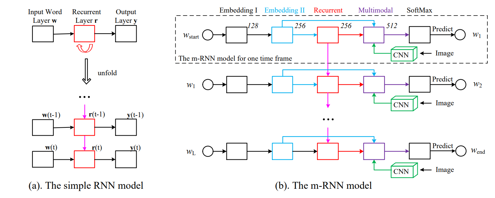
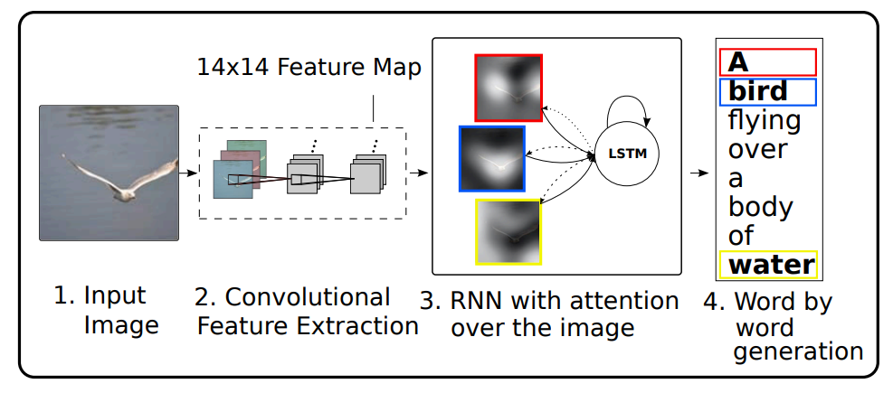
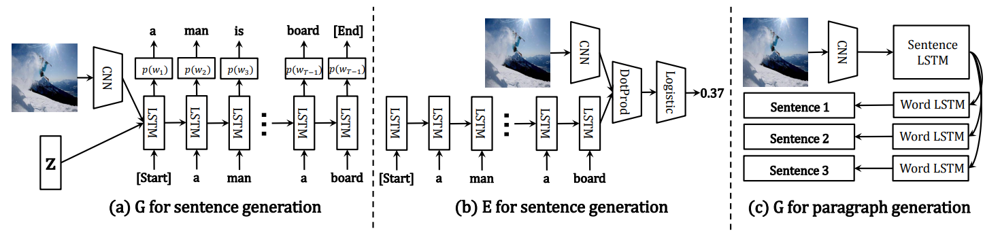

## 题目：基于编解码框架方法的图像描述生成

> 2023 秋季北京邮电大学深度学习与神经网络课程设计

## 一、任务描述

在这个课程设计中，我们的目标是开发一个基于编解码框架的图像描述生成系统。这个系统能够自动为输入的图片生成流畅且关联的自然语言描述。这个任务涉及到计算机视觉和自然语言处理两个领域，需要我们将图像的视觉信息转化为自然语言的文本信息。我们将采用以下的模型结构来实现这个任务：

1. **网格 / 区域表示**：我们首先将输入的图片通过卷积神经网络进行特征提取，得到图片的网格或区域表示。这些表示能够捕捉到图片中的局部信息和全局信息，为后续的描述生成提供基础。
2. **自注意力 + 注意力机制**：我们将使用自注意力机制来处理图片的网格或区域表示。自注意力机制能够计算每个区域与其他区域之间的关系，帮助我们更好地理解图片的内容。同时，我们还将使用注意力机制来关注图片中的重要区域，这样可以使生成的描述更加准确。
3. **Transformer 编码器 + Transformer 解码器**：我们将使用 Transformer 编码器来处理图片的网格或区域表示，得到一个全局的图片表示。然后，我们将使用 Transformer 解码器来生成描述。在解码过程中，我们将使用注意力机制来关注编码器的输出，这样可以使生成的描述更加准确。

我们的任务将分为以下几个步骤：

1. **数据准备**：我们将使用`DeepFashion-MultiModal`数据集中`image`和`textual descriptions`的部分的`90%`的数据作为模型的训练集，剩下的`10%`作为模型的测试集。
2. **模型训练**：我们将使用上述的模型结构的组合来训练我们的图像描述生成系统。在训练过程中，我们会不断调整模型的参数，并尝试增删模型的结构从而使生成的描述能够尽可能地接近真实的描述。
3. **模型测试**：我们将使用划分好的`DeepFashion-MultiModal`数据集中的测试集来测试我们的模型，看看它能否生成准确的描述。
4. **模型优化**：根据测试结果，我们会对模型进行优化，尝试将之前课程中学到的知识与现有的模型进行融合，以提高其性能。

我们希望通过完成这个课程设计作业，来深入理解编解码框架、自注意力机制、Transformer 模型等先进的深度学习技术，并能够将这些技术应用到实际问题中。

## 二、预期目标

自动为图片生成流畅关联的自然语言描述

## 三、相关工作

我们在完成这项课设之前需要了解一下什么是图像描述技术，而其实际上就是以图像为输入，通过数学模型和计算使计算机输出对应图像的自然语言描述文字，使计算机拥有**看图说话**的能力，是图像处理领域中继图像识别、图像分割和目标跟踪之后的又一新型任务。

在日常生活中，人们可以将图像中的场景、色彩、逻辑关系等低层视觉特征信息自动建立关系，从而感知图像的高层语义信息，但是计算机作为工具只能提取到数字图像的低层数据特征，而无法像人类大脑一样生成高层语义信息，这就是计算机视觉中的**语义鸿沟**问题。图像描述技术的本质就是将计算机提取的图像视觉特征转化为高层语义信息，即解决语义鸿沟问题，使计算机生成与人类大脑理解相近的对图像的文字描述，从而可以对图像进行分类、检索、分析等处理任务。

### 3.1 基于编解码器的方法

随着深度学习技术的不断发展，神经网络在计算机视觉和自然语言处理领域得到了广泛应用。受机器翻译领域中编解码器模型的启发，图像描述可以通过**端到端**的学习方法直接实现图像和描述句子之间的映射，将图像描述过程转化成为图像到描述的“**翻译**”过程。基于深度学习的图像描述生成方法大多采用以 `CNN-RNN` 为基本模型的编解码器框架，`CNN` 决定了整个模型的图像识别能力，其最后的隐藏层的输出被用作解码器的输入，`RNN` 是用来读取编码后的图像并生成文本描述的网络模型，下图是一个简单递归神经网络 `RNN` 和多模态递归神经网络 `m-RNN` 架构的示意图：

### 3.2 基于注意力机制的方法

近年来，注意力机制被广泛应用于计算机视觉领域，其本质是为了解决编解码器在处理固定长度向量时的局限性。注意力机制并不是将输入序列编码成一个固定向量，而是通过增加一个上下文向量来对每个时间步的输入进行解码，以增强图像区域和单词的相关性，从而获取更多的图像语义细节，下图是一个学习单词 / 图像对齐过程的示意图：

### 3.3 基于生成对抗网络的方法

生成对抗网络模型中至少有两个模块：生成网络和判别网络。在训练过程中，生成网络生成尽量真实的数据以“**欺骗**”判别网络，并且通过判别网络的损失不断进行学习；而判别网络的任务就是区分生成的数据和真实数据。这两个网络通过**动态的博弈学习**，可以从无标签的数据中学习特征，从而生成新的数据使用生成对抗网络通过控制随机噪声向量来生成多样化的描述，下图展示了用于单句和段落的`生成器 G` 和用于单句的`评估器 E `的结构：

### 3.4 基于强化学习的方法

强化学习（RL）在图像描述生成中的应用越来越广泛。例如，Rennie等人在他们的论文《Self-critical Sequence Training for Image Captioning》中提出了一种新的训练方法。他们使用了`REINFORCE`算法，通过自我批评的方式来优化模型，这种方法直接针对非可微的评估指标进行优化，如`CIDEr`得分。其中`SCST`训练阶段的过程如下图所示：

RL在图像描述中的应用：
- 模型框架：使用代理（字幕生成器）在环境（图像和字幕数据集）中作出决策，并根据评估指标作为奖励信号。
- `REINFORCE`算法：模型通过**优化预期奖励**（如`CIDEr`得分）来学习生成更高质量的字幕。

### 3.5 基于密集描述的方法

密集图像描述旨在**为图像的不同区域生成多个描述性句子**。Johnson等人在他们的论文《DenseCap: Fully Convolutional Localization Networks for Dense Captioning》中展示了这一方法的有效性。他们使用区域建议网络（`RPNs`）来识别图像中的感兴趣区域，并对每个区域生成描述。

密集描述：
- 区域建议网络（`RPNs`）：识别图像中的关键区域，并对每个区域生成描述。
- 综合描述：生成一组描述，涵盖图像的不同元素和区域。

## 四、技术方案

### 4.1 模型结构

#### 4.1.1 网格 / 区域表示、自注意力 + 注意力

> 网格 / 区域表示（Grid/Regional Representation）

网格或区域表示是图像描述生成中的一种关键技术。它涉及将图像分解成一系列的小区域或网格，并提取每个区域或网格的特征。这些特征通常通过卷积神经网络（CNN）提取，可以捕捉到图像中的局部和全局视觉信息。

- **局部视觉信息**：每个区域或网格代表图像的一部分，包含特定的物体或图像片段。
- **全局视觉信息**：通过整合所有区域的信息，可以获得对整个图像的全面理解。

> 自注意力 + 注意力机制（Self-Attention + Attention Mechanism）

自注意力机制和注意力机制是自然语言处理和计算机视觉领域中的重要技术，特别适用于处理序列和图像数据。

- **自注意力机制**：自注意力机制允许模型在处理一个序列时，对序列中不同位置的数据进行权重分配，从而捕获序列内的长距离依赖关系。
- **注意力机制**：在图像描述生成中，注意力机制可以帮助模型集中于图像的特定区域，特别是那些对生成描述最为关键的区域。

> 在`DeepFashion-MultiModal`数据集中应用“网格 / 区域表示、自注意力 + 注意力”

##### 数据集简介

`DeepFashion-MultiModal`数据集包含了大量的时尚图像及其对应的文本描述。这些图像和描述为训练图像描述生成模型提供了丰富的资源。

##### 实验流程

1. **数据准备**：从`DeepFashion-MultiModal`数据集中选取图像及其对应的文本描述。文本描述可能包括关于衣服的样式、颜色、材料等信息。

2. **特征提取（网格/区域表示）**：使用CNN模型（如ResNet或VGG）对每张图像进行处理，得到图像的网格或区域表示。这些表示将作为后续处理的基础。

3. **应用自注意力机制**：对提取的网格或区域表示使用自注意力机制，以捕捉图像内部的细节和关系，增强模型对图像的理解。

4. **应用注意力机制**：在生成描述的过程中，使用注意力机制来专注于图像中的关键区域，如特定的服装或服饰细节。

5. **生成描述**：基于处理后的图像表示和注意力权重，使用解码器（如LSTM或Transformer解码器）生成描述文本。这个过程可能会参考数据集中的文本描述，以确保生成的描述准确且自然。

6. **模型调优和评估**：通过在测试集上评估模型性能，并根据需要进行调优，以提高生成描述的质量和准确度。

#### 4.1.2 网格 / 区域表示、Transformer 编码器 + Transformer 解码器

网格 / 区域表示和 Transformer 编码器 + Transformer 解码器的方法结合了计算机视觉和自然语言处理两个领域的先进技术，能够生成准确且流畅的图像描述。

> Transformer 编码器 + Transformer 解码器：

在图像描述生成任务中，我们可以使用 Transformer 编码器来处理图像的网格或区域表示，得到一个全局的图像表示。然后，我们可以使用 Transformer 解码器来生成描述。在解码过程中，我们可以使用注意力机制来关注编码器的输出，这样可以使生成的描述更加准确。

> 大致流程：

1. **特征提取**：首先，我们需要将输入的图片通过卷积神经网络进行特征提取，得到图片的网格或区域表示。这些表示能够捕捉到图片中的局部信息和全局信息。
2. **编码**：然后，我们将使用 Transformer 编码器来处理图片的网格或区域表示，得到一个全局的图片表示。这个全局的图片表示能够捕捉到图片的整体信息。
3. **解码**：接下来，我们将使用 Transformer 解码器来生成描述。在解码过程中，我们将使用注意力机制来关注编码器的输出，这样可以使生成的描述更加准确。
4. **优化**：最后，我们需要通过优化算法来调整模型的参数，使得生成的描述能够尽可能地接近真实的描述。这个过程通常需要多次迭代，每次迭代都会使模型的性能有所提高。

### 4.2 评测标准

#### 4.2.1 METEOR

METEOR（Metric for Evaluation of Translation with Explicit ORdering）用于评估机器翻译质量，也常用于评估图像描述生成的质量。METEOR 考虑了精确度、召回率和对齐的复杂度，它的计算公式如下：

- $METEOR=P_{mean}(1-Penalty)$

其中，`$P_{mean}$` 是调和平均精确度和召回率，`$Penalty$` 是对齐的复杂度，其公式如下：

- $P_{mean}=\frac{precision×recall}{precision+recall}$
- $Penalty=γ(\frac{chunks}{matches})^β$

`$precision$` 是匹配的单词数占生成描述的单词数的比例，`$recall$` 是匹配的单词数占真实描述的单词数的比例，`$chunks$ `是连续匹配的块数，`$matches$` 是匹配的单词数，而 `$β$` 和 `$γ$` 是超参数。

#### 4.2.2 ROUGE-L

`ROUGE-L`（Recall-Oriented Understudy for Gisting Evaluation with Longest Common Subsequence）是基于最长公共子序列的评估指标，也常用于评估图像描述生成的质量。`ROUGE-L` 考虑了生成描述和真实描述之间的最长公共子序列，它的计算公式如下：

- $ROUGE-L=\frac{LCS(X,Y)}{max(|X|,|Y|)}$

其中，`$X$` 和 `$Y$` 分别是生成描述和真实描述，`$∣X∣$`  和 `$∣Y∣$`  分别是生成描述和真实描述的长度，`$LCS(X, Y)$` 是生成描述和真实描述之间的最长公共子序列的长度。

#### 4.2.3 CIDEr-D

`CIDEr-D`是为图像描述任务设计的评估指标，专注于捕捉生成字幕与参考字幕之间的共识。Vedantam等人在他们的论文《CIDEr: Consensus-based Image Description Evaluation》中详细描述了这一指标。

##### 公式推导

`CIDEr-D`旨在**衡量生成的描述（候选描述）与一组参考描述之间的相似度**。核心思想是**识别生成描述和参考描述之间的共识部分**。计算公式主要包括以下几个步骤：

1. `TF-IDF` 加权：对于每个描述中的词，计算其词频-逆文档频率（`TF-IDF`）权重。这个权重反映了词在描述集合中的重要性。

   - 词频（TF）：词在单个描述中出现的频率。
   - 逆文档频率（IDF）：反映了词在所有描述中的出现频率，较少出现的词将获得更高的IDF值。

2. `n-gram `余弦相似度：将每个描述表示为`n-gram`的向量（通常n取1到4），并计算候选描述和每个参考描述之间的`TF-IDF`加权`n-gram`余弦相似度。

   - 余弦相似度：两个`n-gram`向量的点积除以它们的范数。

3. **CIDEr-D 分数计算**：对所有参考描述计算的余弦相似度求平均，得到最终的CIDEr-D分数。

   - **公式**：对于候选描述`c`和一组参考描述`S`，CIDEr-D分数为：

     \[ \text{CIDEr-D}(c, S) = \frac{1}{m} \sum_{i=1}^{m} \text{cos}(\text{TF-IDF}(c), \text{TF-IDF}(S_i)) \]

     其中，`m`是参考描述的数量，`\(\text{TF-IDF}(c)\)`和`\(\text{TF-IDF}(S_i)\)`分别是候选描述和第`i`个参考描述的TF-IDF加权n-gram向量。

这种方法通过重视那些在参考描述中共同出现但在整个数据集中不常见的词，来评估生成描述的质量。`CIDEr-D`的设计使其特别适用于图像描述任务，因为这些任务通常涉及生成与特定图像相关且信息丰富的描述。
### 4.3 其他内容

#### 4.3.1 实现基于强化学习的损失函数，直接优化评测指标

基于RL的损失函数可通过策略梯度方法实现，如REINFORCE算法。这种方法能够优化评估指标，如`CIDEr`得分。

基于RL的损失函数：
- 策略梯度方法：通过最大化预期奖励（如`CIDEr`得分）来调整模型参数。

#### 4.3.2 微调多模态预训练模型或多模态大语言模型，并测试性能

多模态预训练模型的微调，如`CLIP`或`Visual BERT`，可以显著提升图像描述生成任务的性能。Radford等人在他们的论文《Learning Transferable Visual Models From Natural Language Supervision》中详细介绍了`CLIP`模型，其中zero-shot具体操作如下：

## 五、开发环境

- Linux Ubuntu 20.04 / 22.04 
- NVIDIA GPU
- CUDA 12.2/11.8

## 六、组员分工及检查点

> 分工表：

|                            巩羽飞                            |                       黄成梓                       |
| :----------------------------------------------------------: | :------------------------------------------------: |
| 模型：网格 / 区域表示、Transformer 编码器 + Transformer 解码器 |      模型：网格 / 区域表示、自注意力 + 注意力      |
|                    指标：METEOR + ROUGE-L                    |                   指标：CIDEr-D                    |
|   其他：微调多模态预训练模型或多模态大语言模型，并测试性能   | 其他：实现基于强化学习的损失函数，直接优化评测指标 |

> 检查点：

|        | Point 1  |          Point 2          |     Point 3      |         Point 4          |
| ------ | :------: | :-----------------------: | :--------------: | :----------------------: |
| 巩羽飞 | 开题报告 | 跑通负责的模型 + 评测指标 |     中期报告     | 附加任务微调多模态大模型 |
| 黄成梓 | 开题报告 | 跑通负责的模型 + 评测指标 | 附加任务优化指标 |         结题报告         |

## 七、时间安排

|  11.25   |        11.30        |            12.12            |                12.28                |
| :------: | :-----------------: | :-------------------------: | :---------------------------------: |
| 开题报告 | 模型跑通 + 评测指标 | 中期报告 + 附加任务优化指标 | 结题报告 + 附加任务微调多模态大模型 |

## 八、参考文献

[1] Mao， Junhua et al. “Deep Captioning with Multimodal Recurrent Neural Networks (m-RNN).” *arXiv: Computer Vision and Pattern Recognition* (2014): n. pag.

[2] Xu， Ke et al. “Show， Attend and Tell: Neural Image Caption Generation with Visual Attention.” *International Conference on Machine Learning* (2015).

[3] Dai, Bo et al. “Towards Diverse and Natural Image Descriptions via a Conditional GAN.” *2017 IEEE International Conference on Computer Vision (ICCV)* (2017): 2989-2998.

[4] Rennie, Steven J., et al. "Self-critical sequence training for image captioning." Proceedings of the IEEE conference on computer vision and pattern recognition. 2017.

[5] Johnson, Justin, et al. "DenseCap: Fully Convolutional Localization Networks for Dense Captioning." Proceedings of the IEEE conference on computer vision and pattern recognition. 2016.

[6] Vedantam, Ramakrishna, C. Lawrence Zitnick, and Devi Parikh. "Cider: Consensus-based image description evaluation." Proceedings of the IEEE conference on computer vision and pattern recognition. 2015.

[7] Radford, Alec, et al. "Learning transferable visual models from natural language supervision." arXiv preprint arXiv:2103.00020 (2021).
